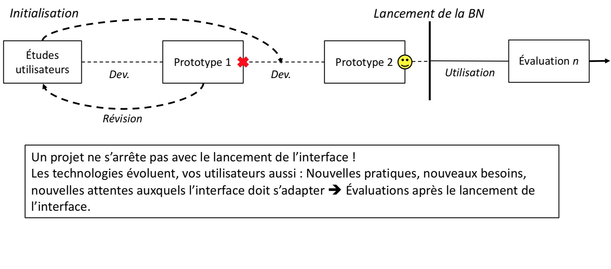
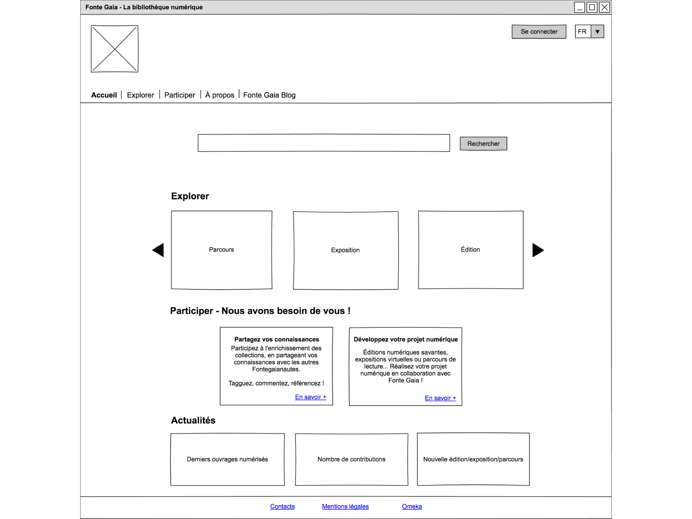

<style>
img[alt~="center"] {
  display: block;
  margin: 0 auto;
}
h1 {
  font-size: 46px;
  color: darkred;
}
h2 {
  font-size: 38px;
  color: darkred;
}
</style>

Bibliothèques numériques I
Gestion de projet (conception, partage, archivage)

# Planifier son projet

Simon Gabay

<a rel="license" href="http://creativecommons.org/licenses/by/4.0/"></a>

---
# Aavant de se lancer: détails techniques

---
## Le flowchart

---
## Le pseudo-code

---
```
fonction f(n):
    """ 
    n est un entier naturel non nul
    renvoie le produit des entiers pairs compris entre 1 et n.
    """
    p ← 1
    Pour k de 1 à n:
        si k est pair:
            p ← p * k
    renvoyer p
```

```python
def f(n):
    """
    n -- entier naturel > 1
    renvoie le produit des entiers pairs compris entre 1 et n.
    """
    p = 1
    for k in range(1, n+1):
        if k%2 == 0: 
            p = p*k
    return p
```


---
# Un projet

---
## 3 grandes étapes

1. Phase préparatoire : Cadre général du projet.
 	a. définir le besoin, les objectifs, le contexte (lieu, temps), les utilisateurs finaux et les contraintes ;
    b. Définir les moyens techniques pour atteindre les objectifs.
2. Phase de réalisation : Organisation de l’activité et planification
	a. Définir les tâches à réaliser
    b. Organiser les tâches (ordre, temps) -> Planning
    c. Établir un plan de communication entre les membres du projet
    d. À la fin de toutes les tâches,tester et documenter la ressource créée.
3. Phase d’exploitation : Mise en ligne et maintenance du projet sur le long terme (préparation de l’après-projet) 

---
## Phase préparatoire
1. Le QQOQCCP:
	* Qui? responsables, public visé
	* Quoi? support, tâches, outils
	* Où?
	* Quand? date de lancement, périodicité, jalons, date de clôture
	* Comment? procédure, ressources matérielles
	* Combien? budget, quantification
	* Pourquoi? justification des objectifs
2. L’état de l’art : Rechercher les données existantes dans un domaine et en faire une synthèse.

---
# Conception de site

---
## Quel objectif?

Deux approches:
* Conception centrée sur le produit : l’utilisateur s’adapte au produit.
* Conception centrée sur l’utilisateur : le produit s’adapte à l’utilisateur.

Dans le second cas on parle d'UCD (_user-centered design_): les attentes et les caractéristiques propres des utilisateurs finaux sont pris en compte à chaque étape du processus de développement d'un produit.

L'utilisateur peut être compris de deux manières:
* réel
* potentiel

---
# ISO 9241-210
L'UCD est une norme ISO (9241-210), définit par cinq critères d'application:
1. La prise en compte en amont des utilisateurs, de leurs tâches et de leur environnement
2. La participation active des utilisateurs, garantissant la fidélité des besoins et des exigences liées à leurs tâches
3. La répartition appropriée des fonctions entre les utilisateurs et la technologie
4. L'itération des solutions de conception, jusqu'à satisfaction des besoins et des exigences exprimés par les utilisateurs
5. L'intervention d'une équipe de conception multidisciplinaire, visant une expérience utilisateur optimale

---
## Design d'expérience utilisateur

L'UCD s'est complexifié: _User Experience_, _User Research_, _Information Architecture_, _Design Thinking_, _User Interface Design_, _Interaction Design_, _Visual Design_, _Usability Evaluation_, etc.

L'expérience utilisateur (UX, _user experience_) est la qualité du vécu de l'utilisateur dans des environnements numériques (ou non).

C'est une démarche empathique : l’objectif de l’UX est de comprendre et d’analyser les pratiques, les besoins et les attentes des utilisateurs afin de leur proposer un site Web qui leur corresponde.

L'_UX Design_, c'est penser du point de vue de l’utilisateur, à partir d’un ensemble de méthodes qui invite cet utilisateur à chaque étape de la conception d’un site Web.

---
## Etape 1


---
## Etape 2


---
## Etape 3



---
## Implication des utilisateurs: approche quantitative

Déterminer de grandes tendances parmi un nombre important de participants: questionnaires, analyse des logs… 
* Méthodes avec un faible pouvoir explicatif, réponses coupées de leur contexte : elles ne donnent que des informations sur ce que les utilisateurs disent qu’ils font, et non sur ce qu’ils font réellement.
* Elles ne mettent en évidence que « ce qui est déjà connu », c’est-à-dire l’explicite, au détriment de l’implicite, autrement dit des comportements si évidents qu’ils ne sont pas précisés par les utilisateurs

---
## Implication des utilisateurs: approche qualitative

Expliquer et approfondir les comportements des utilisateurs à partir de cas concrets: entretiens, observation sur le terrain…
* Résultats à analyser avec précaution.
* Décalage entre les paroles et les actes. Ce décalage peut être intentionnel, dans la mesure où les personnes interrogées peuvent ne pas vouloir révéler certains éléments, ou inconscients (oublis).
* Caractère ponctuel ne dit rien de l’utilisation sur le long terme du produit ni de la réaction des utilisateurs face à un phénomène rare, comme une panne.

---
## _Design thinking_

Méthode inspirée du design, dont l’objectif est de concevoir des ressources en accord avec les pratiques des utilisateurs (UX).

Très populaire dans le monde des bibliothèques (publiques) : prend la forme d’ateliers d’une journée, réunissant des bibliothécaires et des usagers. L'objectif est la création de nouveaux services.

Encourager l’émergence d’idées nouvelles en confrontant des spécialistes et des usagers : réalisation des idées sous la forme de maquettes papier, etc.

---
## Etapes du design thinking
1. Inspiration
	* Familiarisation avec les besoins des usagers
	* Définition d’une problématique.
2. Idéation
	* Imagination de solutions pour répondre à la problématique (_Brainstorming_)
	* Concrétisation des idées (prototypage): maquette papier, jeu de rôle…
3. Itération
	* Présentation du prototype aux usagers
	* Recueil des avis : avantages, inconvénients, défauts de conception, autres usages

---
## Architecture de l'information

Modèle de Jesse James Garrett 

Même objectif qu’un architecte en bâtiment : élaborer un environnement adapté à des besoins spécifiques, en élaborant des plans en amont du développement.

Définition d’un modèle de conception de sites Web, qui place l’expérience
utilisateur au centre, en tant que garant du succès d’un site Web.

Expérience = Pas ce que _fait_ un produit ni son organisation interne (cachée aux utilisateurs), mais _comment_ il le fait:
* Manière dont est organisé ce que voit l’utilisateur
* Manière dont les fonctionnalités sont présentées
* Manière dont ces fonctionnalités proposent spontanément des manières de les utiliser efficaces

---
## Quelques définitions

Distinction entre trois types de _design_ :
1. Design de l’esthétique = beau
2. Design de conception = efficacité
3. Design de l’expérience utilisateur = expérience réussie

Accent mis sur le design UX : Site Web comme objet complexe, sans mode d’emploi. Besoin de s’appuyer sur les connaissances, les capacités et les besoins des utilisateurs pour leur offrir des affordances efficaces.

---
## Cinq niveaux de la conception de site
1. La surface : Site visible et sensible aux utilisateurs ;
2. L’ossature : Organisation du site ;
3. La structure : Manière dont les contenus, les informations et les interactions sont liées ;
4. Le cadrage : Définition du périmètre informationnel et fonctionnel du site.
5. La stratégie : Objectif du site.

---


---
# Maquettage et ergonomie

---
## Le Service 

Services : Tout ce qui assure une rencontre entre un utilisateur et un contenu (Calenge, 1999). C'est la clef de voûte de la relation entre une institution patrimoniale (analogique ou numérique) et ses usages.

Pendant longtemps, **logique de production-distribution**: élaboration de collections et d’outils sans tenir compte du public auxquels ils s’adresseront.

Au cours de la dernière décennie, **logique de servuction**: Prise en compte de l’utilisateur comme contributeur actif de l’institution et développement à partir des besoins des utilisateurs. Déplacement de l’attention du document vers l’utilisateur à travers l’élaboration deservices.

---
## Exemple

Des services qui accompagnent les utilisateurs dans leurs travaux :
* Consultation : Mise à disposition de visionneuses, constitution de dossiers documentaires, expositions virtuelles, timelines, cartes;
* Recherche: Dans les collections: Simple, avancée, parcours à travers les collections (_Browsing_)
* Dans les documents: Recherche plein-texte;
* Aide documentaire: répertoire de liens, bibliographies thématiques...
* Analyse : Proposition d’outils au sein de la bibliothèque numérique ;
* Participation : Ajout de tags et de commentaires, correction de textes océrisés, transcription, partage de collections...
* Réutilisation : export des documents (PDF, images, ePub...), diffusion sur les réseaux sociaux...

---
## Maquettage

Vision globale du site et des fonctionnalités à développer
Quatre grandes étapes
1. _Zoning_ : Première étape du maquettage, l’objectif est de définir grossièrement les principales « zones » de votre site Web (Haut de page, pied de page, sections, visionneuses, colonnes...). 
2. _Wireframe_ : Définition de l’ergonomie de chaque zone, mais pas de création graphique (schéma monochrome). Vous devez entrer dans le détail de chaque zone : textes (taille des corps, graisse, alignement...), éléments visuels (sous forme de cadre grisé : portrait ou paysage), liste d’éléments. Outils : Pencil

---
## Maquettage (suite)

3. _Mockup_ : Maquette graphique, qui s’attache à « l’habillage » de votre site, au rendu visuel (Définition de l’identité visuelle à partir d’une charte graphique : couleurs, logos...). C’est la représentation précise de votre site Web, prête à l’intégration HTML/CCS. Outils : InDesign, Gimp, Photoshop
4. Prototype : Étape qui intervient après le maquettage. Pages fonctionnelles de votre site avec des liens cliquables. Le prototype est consultable depuis votre navigateur.

---



---


---


---


---


---


---
### Remerciements/sources
Merci à Elina Leblanc pour toute son aide et sa connaissance du sujet! Une (grande) partie des slides reprend ses matériaux de cours.
