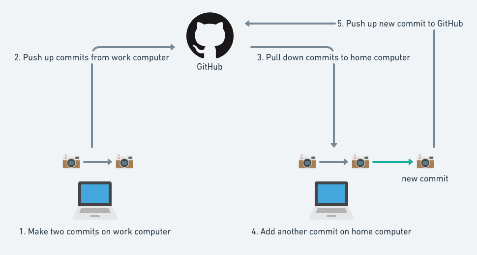
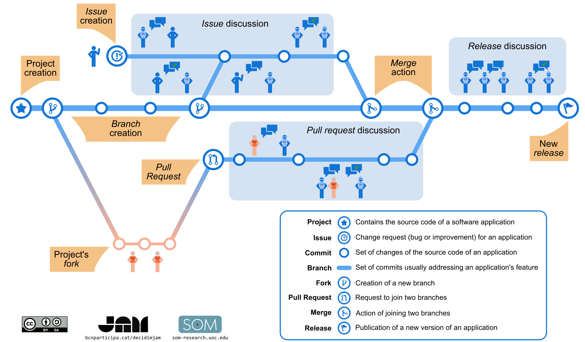
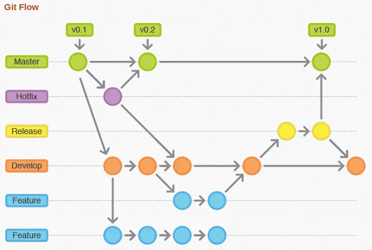
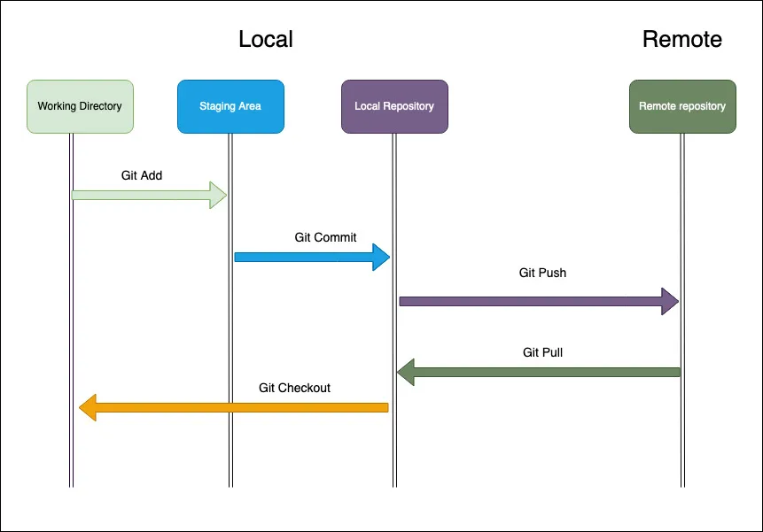

Bibliothèques numériques I
Gestion de projet (conception, partage, archivage)
# Git

Simon Gabay

---
## Git

Git est un logiciel de gestion de versions décentralisé, inventé en 2005 par le créateur de Linux.

Un logiciel de gestion de versions (ou VCS en anglais, pour _version control system_) est un logiciel qui permet de stocker un ensemble de fichiers en conservant la chronologie de toutes les modifications qui ont été effectuées dessus.

Git ne repose pas sur un serveur centralisé, mais il utilise un système de connexion pair à pair. Le code informatique développé est stocké non seulement sur l’ordinateur de chaque contributeur du projet, mais il peut également l'être sur un serveur dédié.

---
## Fonctionnement de base

---
## GitHub vs GitLab

- GitHub est un service web d'hébergement et de gestion de développement de logiciels qui appartient à Microsoft depuis juin 2018: https://github.com
- GitLab est équivalent à GitHub dont le code source est disponible:
  - https://gitlab.unige.ch
  - https://gitlab.huma-num.fr
  - https://gitlab.inf.unibe.ch

Les deux sont très similaires, mais peuvent proposer des options légèrement différentes en plus de Git

---
## Evolution d'un projet

- Les _issues_ sont une sorte de forum pour discuter (problèmes, suggestions de modification…)
- Les _releases_ sont des versions du dépôt assorties d'un _tag_ (alpha, beta, 0.1, 9.3…)
- Les branches sont autant de lignes de développements indépendantes.
  - Main (ex-master)
  - Dev
  - … (on y reviendra)
- Les _forks_ sont des copies d'un dépôt sur son propre espace pour être libre de modifier ce que l'on veut
- Les _pull requests_ demande au propriétaire du dépôt (qui peut être soi-même) de prendre en compte des modifications que l'on a faites sur un fork
- Le _merge_ est l'intégration de modifications dans une branche
 
---

---
## Processus de développement
- On part d'une branche _main_ (ex-_master_), qui est la branche par défaut. Elle existe dans chaque projet.
- Cette branche _main_ doit rester stable: on ne la modifie que si on sûr que l'on ne va rien casser. Chaque changement se fait sur une branche différentes
- En cas d'urgence on va créer une branche spécifique pour régler le problème
- On va donc ajouter une branche _dev_ où l'on va faire les modifications nécessaires, avant de les intégrer dans la branches _main_
- On peut reproduire le processus en ajoutant d'autres branches pour chaque _feature_ que l'on va rajouter à la branche de _dev_

---

---
## Documentation

Il est important de documenter votre travail:
- À chaque `commit`, décrivez très brièvement ce que vous venez de faire pour vous rappeler (`commit -m "DESCRIPTION"`)
- Ajoutez un `README.md` 
  - Ecrivez bien `README.md` sans rien changer
  - Comme c'est en `.md` écrivez en markdown
  - Expliquez bien ce qui se trouve sur le dépôt (et le cas échéant comment le faire marcher)
  - Donnez un moyen de citer votre dépôt (si quelqu'un l'utilise)
  - Explicitez clairement les droits avec une licence (attentin si vous partagez des données qui ne sont pas à vous)

Vous pouvez regarder comment le dépôt du cours est fait: https://github.com/gabays/32M7128

---
## Fonctionnement de base

La mise en ligne se fait en trois temps: `Add`, `Commit`, `Push`.

Prenons une image pour expliquer ce qu'il se passe:

- Je prends des affaires et les mets dans une valise (`Add`)
- Je mets les valises dans le coffre (`Commit`)
- Je pars en voiture (`Push`)

Une fois que les choses sont en ligne je peux les rappatrier (`Pull`)

---

---
## Comment faire concrètement

- Je peux le faire en ligne de commandes
- Je peux utiliser _Github Desktop_: https://desktop.github.com

Il existe plein de tutoriels en ligne, comme la doc officielle de GitHub: https://docs.github.com/en/desktop/overview/creating-your-first-repository-using-github-desktop

---
## Le _tip_ du pro

Vous pouvez transformer votre dépôt en serveur pour héberger votre site en HTML en utilisant _GitHub Pages_ (https://pages.github.com)
- Le nom du dépôt doit suivre le format suivant: `NomDuDepot.github.io`
- On ne peut pas choisir l'adresse: ce sera le nom du dépôt
- Il ne peut y avoir qu'un seul dépôt qui a ce fonctionnement par personne/organisation
- Il faut que la page d'accueil s'appelle `index.html`

Pour ceux qui veulent publier un site plus qualitatif et maîtrisent les lignes de commande, le projet _MkDocs_ est très pratique (https://www.mkdocs.org)

---
## Dernières remarques

- Les pseudos sont les bienvenus (attention quand même…)
- Distinguez votre personne de votre projet en créant une organisation. Vous pouvez créer plusieurs organisations (https://docs.github.com/en/organizations/collaborating-with-groups-in-organizations/creating-a-new-organization-from-scratch)

---
## Exercice

- Créez un dépôt
- Pouchez une modification
- Modifiez un fichier en ligne
- Poulez 🐔 le résultat
- Clonez le dépôt d'un autre
- Pouchez une modification sur cet autre dépôt
- Débrouillez-vous avec les branches, j'ai pas le temps 😁