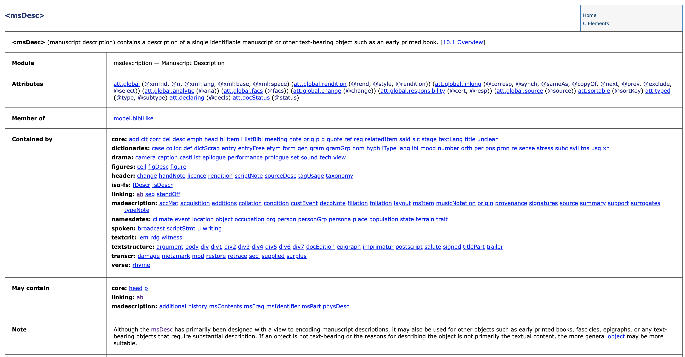

Bibliothèques numériques I
Gestion de projet (conception, partage, archivage)

# Modéliser les données

Simon Gabay
Genève

---
# Remarques introductives

---
## _In principio erat verbum_
* Importance de la linguistique computationnelle dans les humanités numériques (compter les mots)
* La TEI fondée par l’_Association for Computers and the Humanities_, l’_Association for Computational Linguistics_ et l’_Association for Literary and Linguistic Computing_
* D’où l’importance de l’étude des textes avant les autres choses (objets, musique, films...)

---
## Description et échange des données
* Importance des institutions patrimoniales (musées, bibliothèques, archives)
* Les systèmes d’échange synthétisent les données essentielles à la description
* XML est le moyen privilégié de l’échange de données – et il est lisible par l’être humain
* Autant de raison de s’attarder sur ces formats, entre autres pour des raisons pédagogiques
* Il existe évidemment des systèmes bien plus complexes...

---
# Dublin core

---
## Dublin core

_Dublin Core Metadata Initiative_ (DCMI), créée en 1995, Dublin (Ohio, pas Irlande). Elle permet de décrire des documents de manière simple et standardisée
En deux parties:
  * _Dublin Core element set_: quinze propriétés
  * _Dublin Core metadata terms_: d’autres propriétés supplémentaires

Vous trouverez plus de documentation en ligne: https://www.dublincore.org/specifications/dublin-core/profile-guidelines/

---
## _Dublin Core element set_

| Nom         | Description                                    |
|-------------|------------------------------------------------|
| Title       | Nom donné à la ressource                       |
| Creator     | Nom de la personne responsable de la création de la ressource |
| Subject     | Thème du contenu                               |
| Description | Présentation du contenu                        |
| Date        | Date de création                               |
| Language    | Langue du contenu intellectuel                 |
| Relation    | Référence à une ressource apparentée           |
| Coverage    | Couverture spatio-temporelle                   |
| Rights      | Informations sur les droits associés           |

---
## DCMI element set: suites
| Nom         | Description                                    |
|-------------|------------------------------------------------|
| Publisher   | Organisme de diffusion                         |
| Contributor | Personne responsable de contributions au contenu |
| Type        | Nature ou genre                                |
| Format      | Manifestation physique ou numérique            |
| Identifier  | Référence univoque dans un contexte donné (URI, ISBN) |
| Source      | Référence dont la ressource décrite est dérivée (URI) |
| …           | …                                              |

---
## Metadata Terms (extension de l’_element set_)
* `dateCopyrighted`
* `rightsHolder`
* `created`
* `issued`
* `provenance`
* `isPartOf`
* `isVersionOf`
* `hasVersion`
* `tableOfContents`

---
## Entre vocabulaire et langage

* Dublin core est un vocabulaire du web sémantique
* Il utilisé pour exprimer les données dans un modèle RDF (_Ressource description framework_)
* Il peut être exprimé avec une syntaxe XML (`.xml`)
* Il peut être exprimé avec une syntaxe Turtle (`.ttl`)
* Il peut être exprimé avec une syntaxe N-Triples (`.nt`)

---

## Plus loin que DC
* _MAchine-Readable Cataloging_ (MARC)
* _Metadata Object Description Schema_ (MODS, entre DC et MARC)
* _Metadata Encoding and Transmission Standard_ (METS)

Echanger les données
* Open Archives Initiative Protocol for Metadata Harvesting (OAI-PMH)
-> [Exemple d'e-codices](http://e-codices.unifr.ch/oai)
* SRU=Search/Retrieve via URL
-> [Exemple de swissbib](http://sru.swissbib.ch)

---
# La TEI: définitions et dérivations

---
## `<MsDesc>`
`<MsDesc>` permet de décrire le manuscrit
* `<msIdentifier>` pour la cote
* `<author>` pour l’auteur
* `<docDate>` pour la date
* `<support>` pour la description du matériaux (parchemin, vélin...)
* `<extent>` pour le format (taille, longueur...)
* `<condition>` pour son état de conservation
* La description peut être extrêmement complexe (mains,
enluminures, sceaux, filigranes)
* Description de manuscrit: _Antiphonarium Lausannense. De Sanctis, pars hiemalis. Officium B.M.V. Commune Sanctorum_: sur [www.e-codices.ch](https://www.e-codices.ch/en/list/one/aef/CSN-III-3-5)

---
## La documentation

Il existe des dictionnaires définissant chacun des termes. Cf. https://www.tei-c.org/release/doc/tei-p5-doc/en/html/index.html pour la TEI

---
## `<MsDesc>` +
* "Détournement" (ou plus précisément "changement de sémantisme") de `<msDesc>`
* Bibliographie matérielle, pour les catalogues de livres (anciens)
* Pour décrire le support des inscriptions épigraphiques
* Description d’épigraphie (cf. [ISic0298](http://sicily.classics.ox.ac.uk/inscription/ISic0298))

---
## Attention à la documentation

Il faut toujours (ou presque) suivre la documentation en anglais

Définition en anglais:

Définition en français

---
# LIDO

---
## Lightweight Information Describing Objects
* C’est un format d’échange de données
* Il permet de décrire les objets et les ressources numériques (images, textes, sons, vidéos)
* 14 groupes d’informations, dont 3 sont obligatoires
* 5 types de groupes d’information

Plus d'information ici: https://lido-schema.org/schema/v1.1/lido-v1.1.html

---
LIDO 1: classification
1. **`Object/Work type`** (classification)
2. `Classification` (style, forme, âge...)

LIDO 2: événements
3. `Event set` (création, exposition. . . On y reviendra)

LIDO 3: relations
4. `Subject set` (objet, bâtiments, personnes dans l’œuvre)
5. `Related Works`

---
LIDO 4: identification
6. **`Title/Name`**
7. `Inscriptions` (transcription et ou description)
8. `Repository/location` (institution et numéro d’inventaire)
9. `State/Edition`
10. `Object description`
11. `Measurements`

LIDO 5: Administration
12. `Rights`
13. **`Record`**
14. `Ressources`

---
## Autres formats pour les musées
* museumdat (www.museumdat.org)
* SPECTRUM XML (http://www.collectionstrust.org.uk/spectrum)
* CIDOC-CRM (http://www.cidoc-crm.org/)

---
# Linked data (CIDOC et autres)

---
## LIDO et CIDOC-CRM

Lien avec CIDOC-CRM (_Conceptual reference model_)
* LIDO est un format de description (comme DC)
* CIDOC CRM est un modèle conceptuel (comme FRBR)
* Ce modèle de données est "orienté événement"

Ce modèle "orienté événement" décrit les événements de la vie d’un objet pour décrire ce dernier _via_:
* un/des agent(s)
* une date ou un intervalle dans le temps
* un lieu
* un type d’événement

---
## FRBR

* Œuvre : une création intellectuelle ou artistique déterminée (par exemple : _La Divine Comédie_)
* Expression : une réalisation de cette création intellectuelle (par exemple, l'édition de Petrocchi, la traduction de Risset)
* Manifestation : la matérialisation d'une expression (la traduction de Risset publiée chez GF)
* Item : un exemplaire isolé d'une manifestation (par exemple, la traduction de Risset publiée chez GF publiée à la BGE).

---
## FRBR

---
## FOAF

---
## Un modèle "orienté événement"

* Creation
* Modification
* Part addition
* Part removal
* Excavation
* Acquisition
* Finding
* Exhibition
* Move
* Restoration
* Loss
* Destruction

---
## CIDOC-CRM simplifié

---
## Les quatre W (_who_, _what_, _when_, _where_)

---
## Exemple: Le _Monument à Balzac_ de Rodin

---
## Exercice

Encodez votre identité