<style>
img[alt~="center"] {
  display: block;
  margin: 0 auto;
}
h1 {
  font-size: 46px;
  color: darkred;
}
h2 {
  font-size: 38px;
  color: darkred;
}
</style>

Numériser le patrimoine I: standards et bonnes pratiques

# L'image numérique

Simon Gabay
Genève

<a rel="license" href="http://creativecommons.org/licenses/by/4.0/"></a>

---

# Une image numérique

---

Deux types d’images:
* Image vectorielle
* Image matricielle (ou bitmap)
---

## Image vectorielle (I)
* Représenter les données de l’image par des formules géométriques qui vont pouvoir être décrites d’un point de vue mathématique (abscisse et ordonnée)
* C’est notamment le format svg (pour _Scalable Vector Graphics_)
* En pratique : pas de problème si on zoom.
---

## Image vectorielle (II)
```{xml}
<svg>
 <rect width="100" height="80" x="0" y="70" fill="green"/>
 <line x1="5" y1="5" x2="250" y2="95" stroke="red" />
 <circle cx="90" cy="80" r="50" fill="blue" />
 <text x="180" y="60">Un texte</text>
</svg>
```
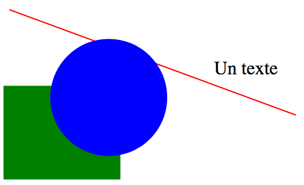

---
## Image vectorielle (III)

Ouvrez le fichier ```image.svg``` dans un navigateur et dans un éditeur de code: comparez!

Pour plus d'exemples, allez regarder du côté de [w3schools](https://www.w3schools.com/graphics/svg_examples.asp).

---

## Une image bitmap (I)
* Composée d’une matrice (tableau) de points à plusieurs dimensions. Dans le cas des images à deux dimensions (le plus courant), les points sont appelés pixels.
* C’est notamment le format jepg, gif, png ou tif.
* Ces différents formats se différencient par le nombre de couleurs, leur compression (avec ou sans perte), la possibilité d’un affichage progressif.
* En pratique : problème si on zoom.

---

## Une image bitmap (II)
Deux fois la même image matricielle
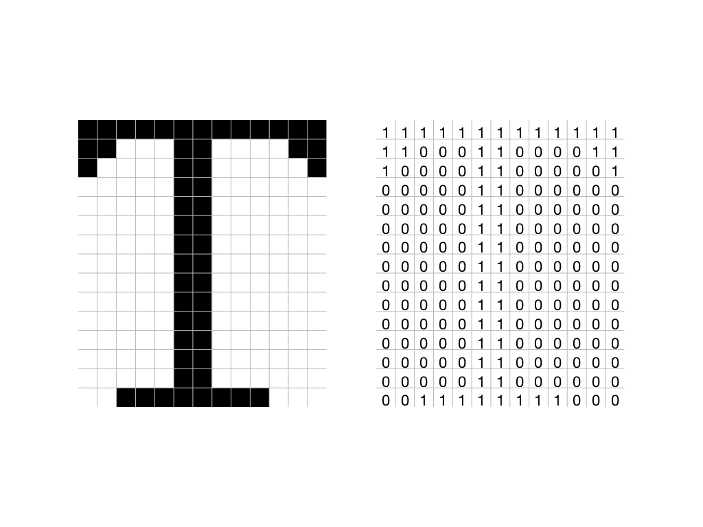

---

## Les caractéristiques techniques d'une image
* Sa taille en points (ou pixels)
* Ses dimensions réelles (en centimètres ou plus souvent en pouces) – un pouce faisant c. 2.4 cm
* On parle donc de _dpi_ (_dot per inch_) ou _ppp_ (_point par pouce_) pour la résolution, soit un nombre de pixels par unité de longueur.
* Meilleure est la résolution, meilleure est l'OCRisation


---
## _PPI_

| Image				         		 | ppp	|
|--------------------------|------|
|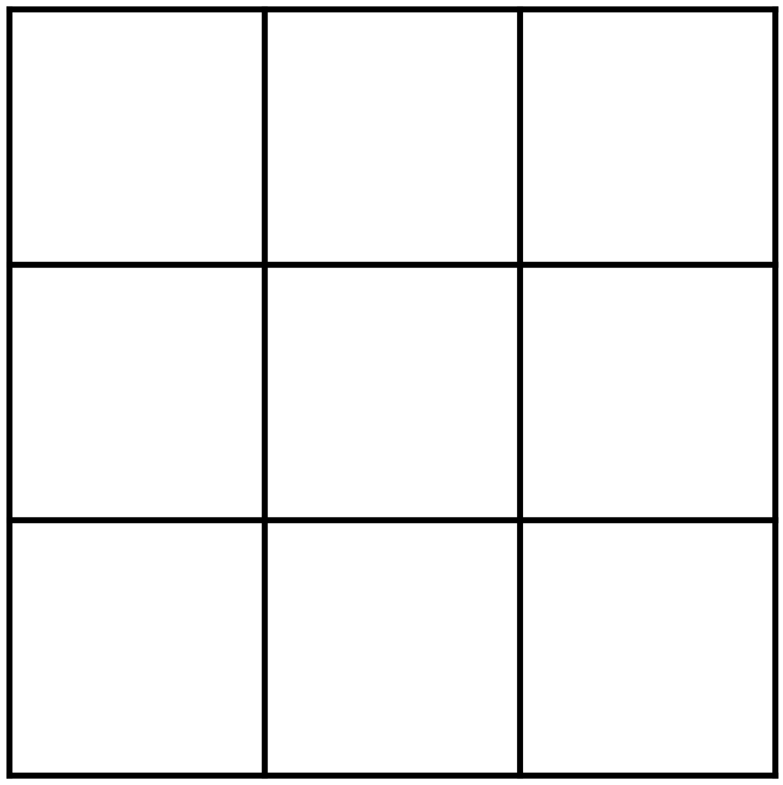	 | 	3	  |
|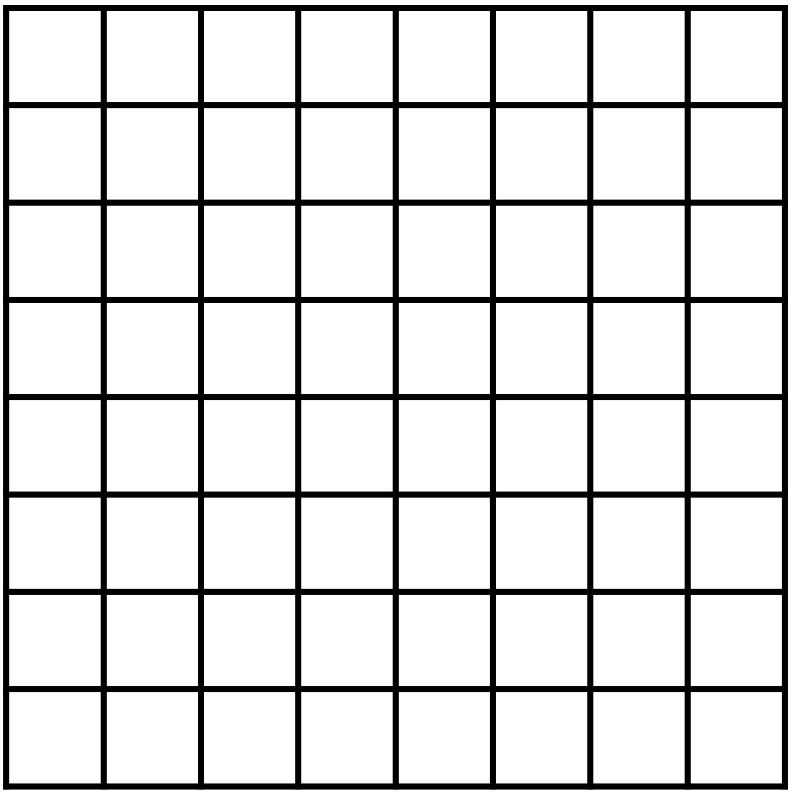	 |	8  	|
|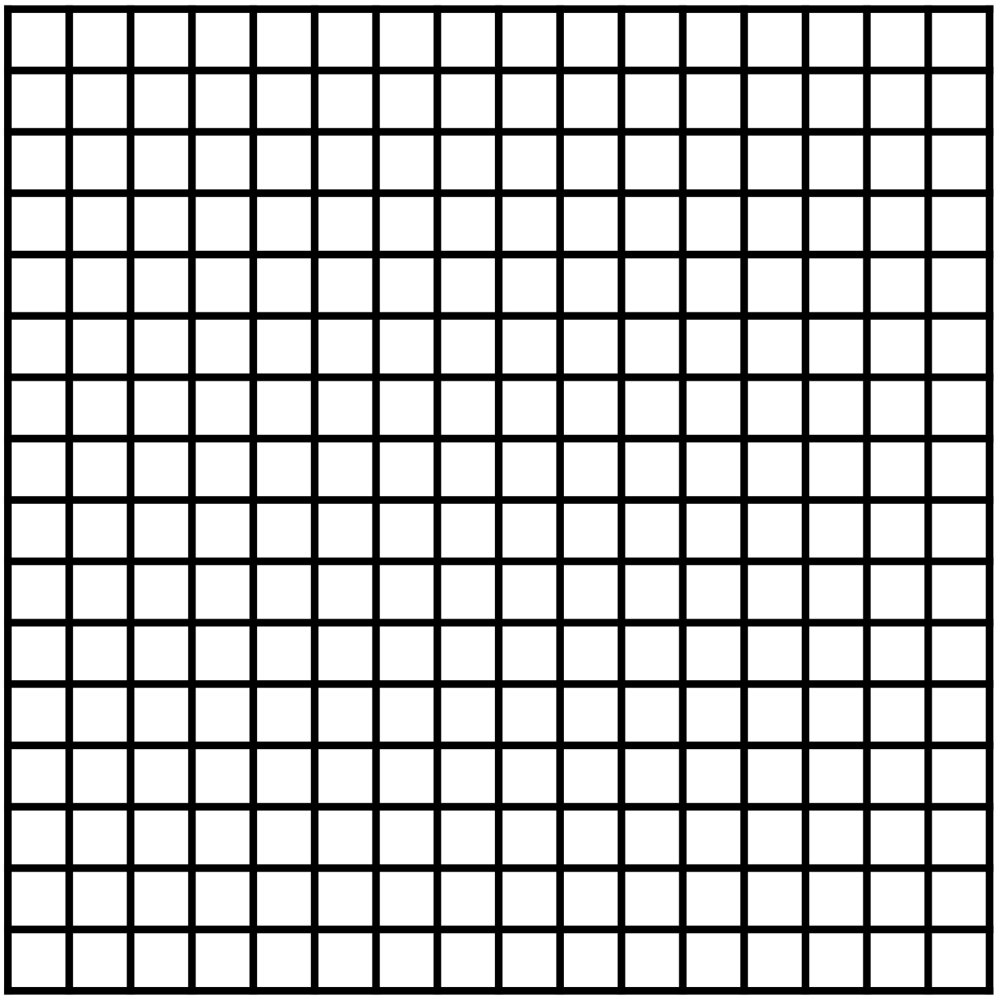 |	16	|

---
## _PPI_ en pratique: la lettre A

| Image						          	| ppp	|
|-----------------------------|-----|
|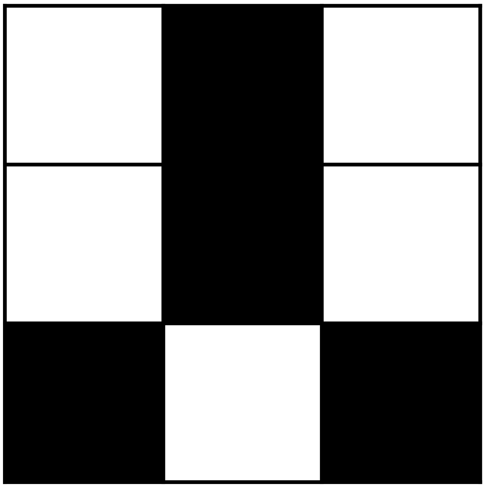		| 	3 |
|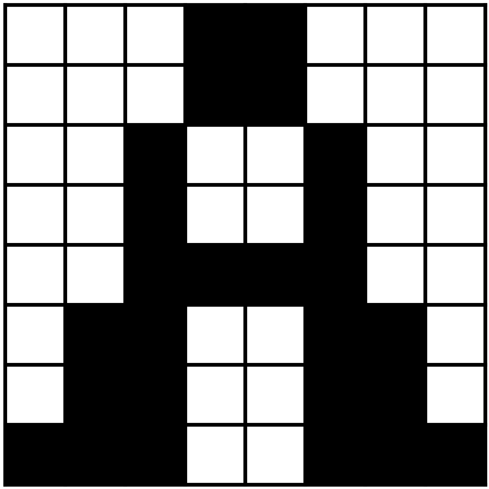		|	 8 	|
|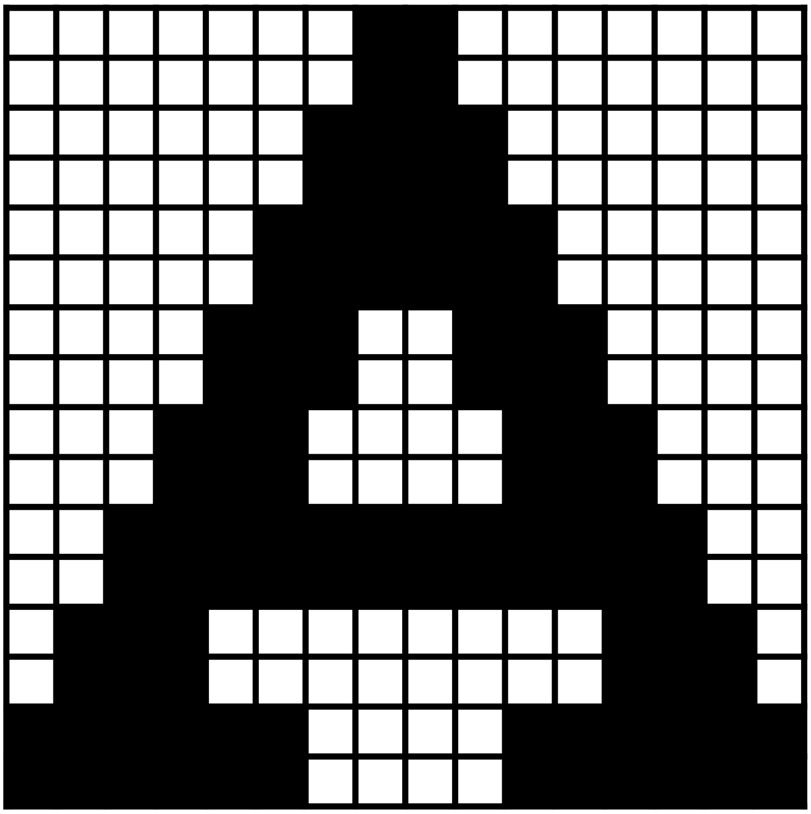	|	 16	|

---
## Poids de l'image

Résolution d’une page A4: (dpi*(21/2.54)) * (dpi*(29.7/2.54))


|dpi   | pixels      | total     |
|------|-------------|-----------|
|100   |  826 x 1169 |   965 594 |
|200   | 1650 x 2340 | 3 861 000 |
|300   | 3500 x 2480 | 8 680 000 |

<p style="color:red">Il est louable de vouloir avoir de bonnes images pour l'OCR, mais attention au poids de l'image finale!</p>

---

## Le _B-test_

L'enjeu est de réussir ce que nous appellerons le _B-test_

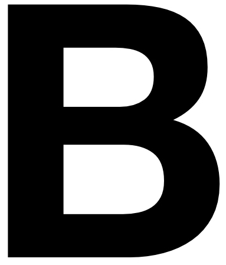 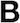 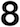


---
## Résolution vs efficacité

Il n’est pas nécessaire d’avoir un grand nombre de pixels (au contraire) pour bien faire fonctionner un OCR.

La schématisation de l'image obtenue par sa pixelisation est une force: trop d'information tue l'information.

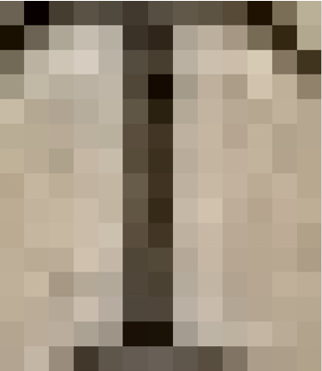 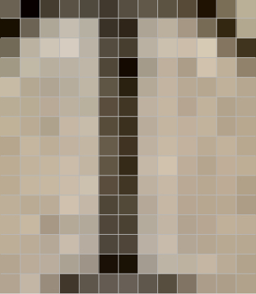 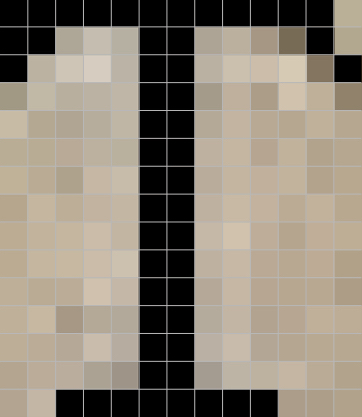 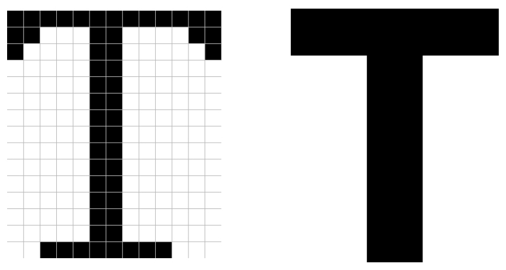

---

## La bonne résolution

300 dpi serait le meilleur rapport poids/qualité
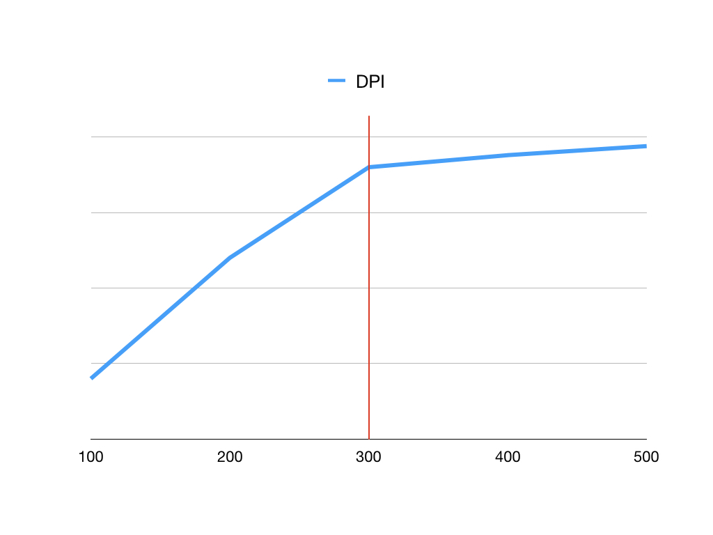


---

# Récupération d'images automatisée

---

## Chaîne de traitement

Projet Gallic(orpor)a: A. Pinche, J.-B. Camps, S. Gabay, B. Sagot, R. Bawden, P. Ortiz Suárez

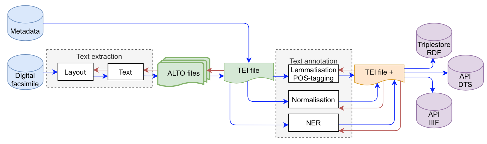


---

## IIIF

IIIF est un ensemble de spécifications techniques dont l'objectif est de définir un cadre d'interopérabilité pour la diffusion et l'échange d'images haute résolution sur le web.

_The IIIF Image API specifies a web service that returns an image in response to a standard HTTP or HTTPS request. The URI can specify the region, size, rotation, quality characteristics and format of the requested image._ (cf. [IIIF documentation](https://iiif.io/api/image/2.1/))


https://iiif.io

---

## IIIF: métadonnées

<style scoped>
table {
    height: 100%;
    width: 100%;
    font-size: 20px;
}
th {
    color: blue;
}
</style>

L'URI d'un manifeste est la suivante:

| {scheme}:// | {server}       | /{prefix} | /{identifier}            |
|-------------|----------------|-----------|--------------------------|
| https://    | gallica.bnf.fr | /iiif     | /ark:/12148/bpt6k313644d |

https://gallica.bnf.fr/iiif/ark:/12148/bpt6k313644d/manifest.json

Ici l'identifiant est un ark (cf. explications [ici](https://fr.wikipedia.org/wiki/Archival_Resource_Key)).

Pour récupérer les métadonnées d'une image: 

| {scheme}:// | {server}       | /{prefix} | /{identifier}               |
|-------------|----------------|-----------|-----------------------------|
| https://    | gallica.bnf.fr | /iiif     | /ark:/12148/bpt6k313644d/f1 |

https://gallica.bnf.fr/iiif/ark:/12148/bpt6k313644d/f1/info.json

---

## IIIF: données

<style scoped>
table {
    height: 100%;
    width: 100%;
    font-size: 20px;
}
th {
    color: blue;
}
</style>

| /{region}        | /{size} | /{rotation} | /{quality}  | /{format} |
|------------------|---------|-------------|-------------|-----------|
| /50,50,1500,1500 | /full   | /0          | /bitonal    | .jpg      |

https://gallica.bnf.fr/iiif/ark:/12148/bpt6k313644d/f15/50,50,1500,1500/full/0/bitonal.jpg

pour extraire une image:

- commençant à 50 sur l'axe horizontal, 50 sur l'axe vertical, de 1500 pixels de largeur et 1500 pixels de hauteur
- en pleine résolution
- sans rotation
- en noir et blanc au format `.jpg`

---

<style scoped>
table {
    height: 100%;
    width: 100%;
    font-size: 20px;
}
th {
    color: blue;
}
</style>

pour extraire une image commençant à 0 sur l'axe horizontal, 1900 sur l'axe vertical, de 2400 pixels en largeur et 1200 pixels en hauteur, à laquelle on applique ensuite une rotation de 90°.

| /{region}         | /{size} | /{rotation} | /{quality}  | /{format} |
|-------------------|---------|-------------|-------------|-----------|
| /0,1900,2400,1200 | /full   | /90         | /native     | .tif      |

https://gallica.bnf.fr/iiif/ark:/12148/bpt6k313644d/f15/0,1900,2400,1200/full/90/native.tif

pour redimensionner l'image originale en une nouvelle image de 750 pixels en largeur, à laquelle on applique ensuite une rotation de 135°.

| /{size} | /{region} | /{rotation} | /{quality}  | /{format} |
|---------|-----------|-------------|-------------|-----------|
| /full   | 750,      | /135        | /gray       | .pdf      |

https://gallica.bnf.fr/iiif/ark:/12148/bpt6k313644d/f15/full/750,/135/bitonal.pdf

---

Exercice:
1. utiliser IIIF: ark:/12148/bpt6k1280589b/
2. Installez l'add-on IIIF si vous avez Firefox: https://addons.mozilla.org/fr/firefox/addon/iiif-download/
3. Créez un projet sur eScriptorium et importer le fichier via IIIF

---

## Charger les documents

Dans le dossier `exercices` se trouvent dix lots contenant chacun une mazarinade au format pdf et un lien vers son *manifest* IIIF. 

- Commencer par vous répartir les documents (un par personne) ;
- Essayer dans un premier temps de charger le document via IIIF (le `manifest` se trouve dans le `README.md`) ;
- Si ça ne fonctionne pas, charger le document au format pdf.
