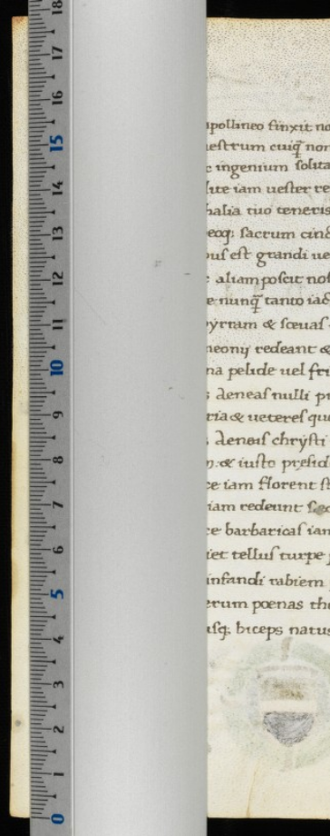
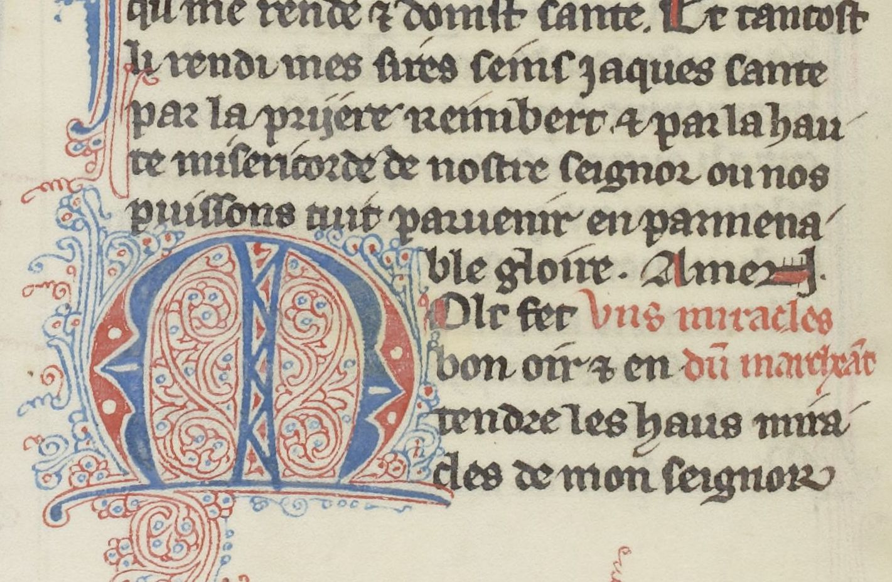
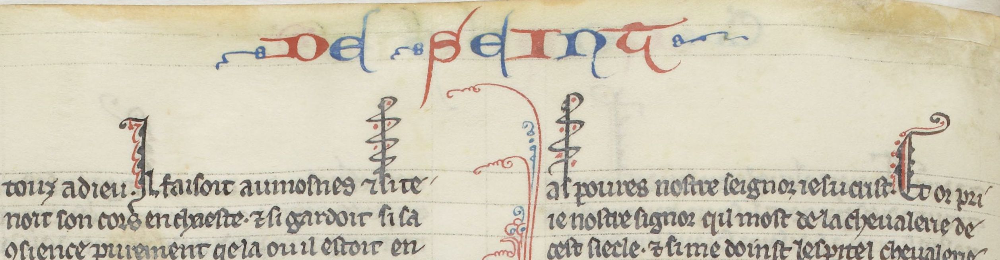
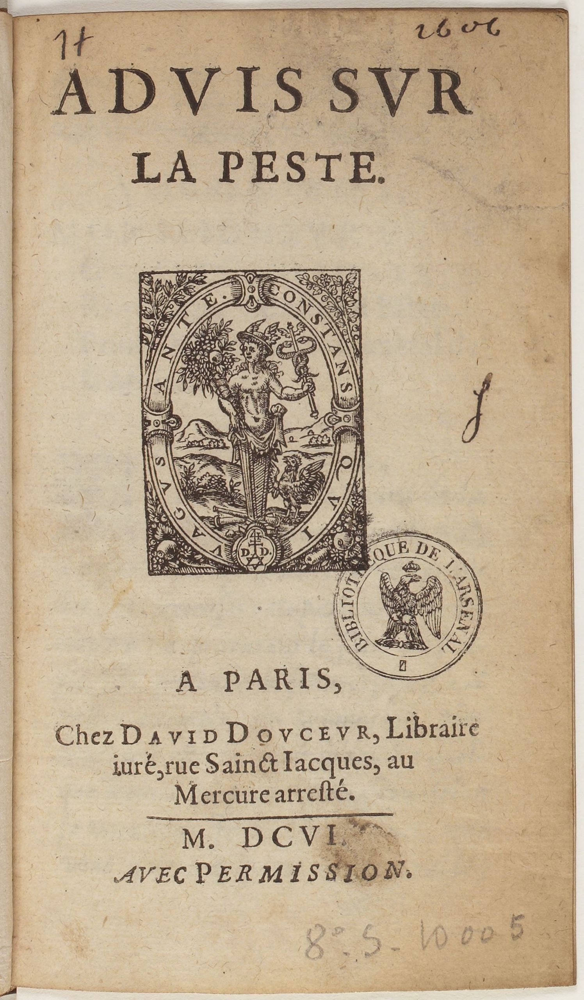
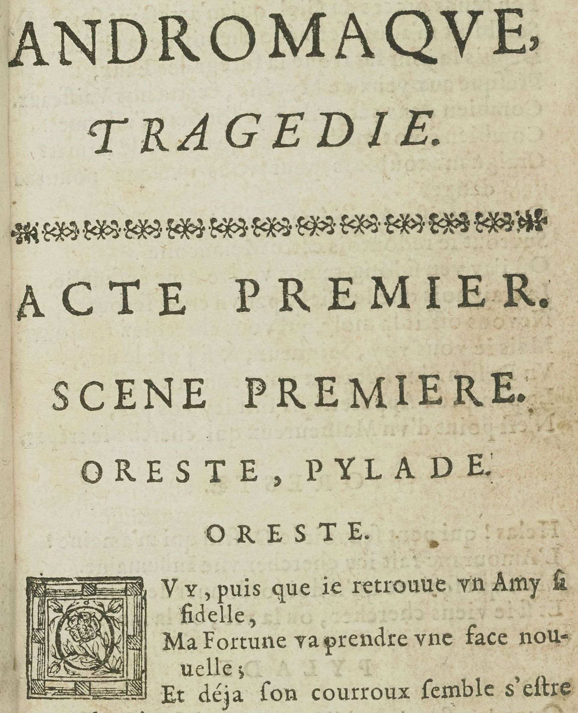

Numériser le patrimoine I: standards et bonnes pratiques

# L'analyse de mise en page

Simon Gabay
Genève

---

# _Pre-processing_

---

## Rotation

| Original 									  | Résultat							   |
|---------------------------------------------|----------------------------------------|
|  | |

---
## Niveau de gris

| Original 								| Résultat							   		|
|---------------------------------------|-------------------------------------------|
|  | |

---
## Binarisation

| Original 									 | Résultat							   		|
|--------------------------------------------|------------------------------------------|
|  | |

---
## Segmentation I

| Original 									| Résultat							   		   |
|-------------------------------------------|----------------------------------------------|
|  | |

---
## Segmentation: mise en page

---
## Segmentation: lignes

L'OCR fonctionnant au niveau des lignes, il est fondamental de les extraire au mieux. L'utilisation d'outil dédié à la segmentation, et non d'un segmenteur intégré à l'OCR, peut être intéressant

---
## Segmentation: ornements

Le segmenteur peut extraire plus que des lignes: il peut extraire, par exemple, des ornements (bandeaux, initiales, culs-de-lampe…)

---

# _SegmOnto_

---
## Intuition

---
## Principes

Titre courant, numéro de page, corps du texte, initiale, rubrique...

Approche générale plutôt que spécifique

Mise en page plutôt qu’analyse sémantique

Une standardisation est cruciale pour la numérisation massive des documents qui s’annonce

---
## Double objectif

- Partager les données (_upstream_): l’intelligence artificielle a besoin de données: les équipes de recherche ont besoin de partager des documents annotés pour améliorer les résultats de l’HTR en augmentant la quantité de données d’entraînement
- Partager les données (_downstream_): les équipes de recherche ont aussi besoin de mettre en commun des post-traitement de données pour l’exploration des corpus et la production/transformation automatisée de documents (TEI, RDF...)

→ Trouver un vocabulaire partagé et contrôlé pour décrire la page

---
## Trouver un vocabulaire

Plutôt de créer un vocabulaire, il est préférable de s’appuyer sur de l’existant
- Vocabulaire PAGE xml, avec très peu de catégories
- Vocabulaire _Codicologia_, un vocabulaire multilingue pour la description des manuscrits, avec énormément de catégories, et adapté pour le RDF (Vocabulaire international de la codicologie - SKOS)

Liens:
- http://codicologia.irht.cnrs.fr/
- http://gams.uni-graz.at/archive/objects/o:voccod/methods/sdef:SKOS/get

---

## Zones

| Zones                      | Zones (suite)             |
|----------------------------|---------------------------|
| `CustomZone`               | `NumberingZone`           |
| `DamageZone`               | `QuireMarksZone`          |
| `DigitizationArtefactZone` | `RunningTitleZone`        |
| `DropCapitalZone`          | `SealZone`                |
| `GraphicZone`              | `StampZone`               |
| `MainZone`                 | `TableZone`               |
| `MarginTextZone`           | `TitlePageZone`           |
| `MusicZone`                |                           |

---
## Lignes

- `CustomLine`
- `DefaultLine`
- `DropCapitalLine`
- `HeadingLine`
- `InterlinearLine`
- `MusicLine`

---

## `CustomZone`
- Definition: characterises any kind of zone not fitting in the other categories, according to any convenient typology the user chooses.
- Subtypes: Any
- Examples: encoding catalogue entries with
  - `CustomZone:entry#1`
  - `CustomZone:entry#2`

---

## `DamageZone`

## Definition

**DamageZone:** characterises any area containing damage to the source, such as holes in the material (parchment, paper…), blots, etc.

## Subtypes

Suggested values include:

* `DamageZone:corrosion` (_corrosion_)
* `DamageZone:hole` (_trou_)
* `DamageZone:mold` (_moisissure_)
* `DamageZone:peeled` (_desquamé_)
* `DamageZone:soaked` (_détrempé_)
* `DamageZone:scuffed` (_eraillé_)
…

---

## `DamageZone` 2

## Examples

* `DamageZone:soaked`

* `DamageZone:hole`

 
## Justification

Identifying damaged area might prove useful, as they can affect the result of text prediction.

---

## `DigitizationArtefactZone`

### Definition

**DigitizationArtefactZone:** contains any type of item external to the document itself, but due to the process of digitisation, such as rulers or color tables added to help analyse the image.

### Subtypes

Suggested values include:

* `DigitizationArtefactZone:testCard` 

* `DigitizationArtefactZone:ruler` 

---

## `DropCapitalZone`

### Definition

**DropCapitalZone:** contains any type of initial letter, occupying a space corresponding to several lines of the main text or bearing significant ornementation, be they historiated, ornated, flourished or painted initials (and excluding the following text line).

### Subtypes

Suggested values include:

* `DropCapitalZone:historiated`
* `DropCapitalZone:floriate`
* `DropCapitalZone:flourish`
* `DropCapitalZone:voided`
* `DropCapitalZone:parted`

---

## `DropCapitalZone`

* `DropCapitalZone:champ`
* `DropCapitalZone:facetted`
* `DropCapitalZone:plain`
* `DropCapitalZone:interlocked`

### Examples

---

## `GraphicZone`

### Definition

**DecorationZone:** characterises a zone containing any type of graphic element, from purely ornamental  to consubstantial to the text (e.g., full page paintings, line-fillers, marginal drawings, figures, etc.).

### Subtypes

Suggested values include:

* `GraphicZone:illustration`
* `GraphicZone:ornamentation`
* `GraphicZone:figure`

---
## `GraphicZone`

### Examples

* `GraphicZone:illustration`

* `GraphicZone:ornamentation`

* `GraphicZone:figure`

---

## `MainZone`

### Definition

**MainZone**: the main area (text column) designed to contain text, either as a single  or several columns (as designed in the conception of the layout: including eventually text, music notations, illumination, etc.).

### Subtypes

Suggested values include:

- `MainZone#column`

### Examples

- `MainZone:column#1` and `MainZone:column#1`

---

## `MarginTextZone`

## Definition

**MarginTextZone:** characterises any **text zone** contained in the margins (upper, lower, inner or outer), including the space between two columns, whatever their semantic status (gloss, additions, …).

## Subtypes

Suggested values include:

* `MarginTextZone:note`
* `MarginTextZone:commentary`
* `MarginTextZone:correction`
* `MarginTextZone:variants`

---

## `MarginTextZone`

## Examples

* `MarginTextZone:variantes`  `MarginTextZone:note`)

---

## `MusicZone`

### Definition

**MusicZone:** characterises an area containing musical notations, such as neumes, staves, etc., with the possible inclusions of text.

### Subtypes

None

### Examples

---

## `NumberingZone`

### Definition

**NumberingZone:** characterises a zone containing the page number.

### Subtypes

Suggested values include:

* `NumberingZone:page`
* `NumberingZone:other`

### Examples

---

## `QuireMarksZone`

### Definition

**QuireMarksZone:** characterises a zone containing a quire signature (i.e., _a ii_), catchword, or any kind of element relative to the material organisation of the source, with the exclusion of page numbers.

### Subtypes

Suggested values include:

* `QuireMarksZone:signature`
* `QuireMarksZone:catchwords`

---

## `QuireMarksZone`

### Examples

* `QuireMarksZone:catchwords`

* `QuireMarksZone:signature`

---

## `RunningTitleZone`

### Definition

**RunningTitleZone:** characterises a zone containing a running title.

### Subtypes

None

### Examples

---

## `SealZone`

### Definition

**SealZone:** characterises a zone containing a seal.

### Subtypes

None

### Examples

---

## `StampZone`

## Definition

**StampZone:** characterises a zone containing a stamp, be it a library stamp or a mark from a postal service.

## Subtypes

Suggested values include:

* `StampZone:postal`
* `StampZone:curatorial`

---

## `StampZone`

## Examples

* `StampZone:postal`

* `StampZone:postal`

---

## `TableZone`

### Definition

**TableZone:** characterises a zone containing a table of any kind.

### Subtypes

None

### Examples

---

## `TitlePageZone`

### Definition

**TitlePageZone:** characterises a zone containing a title distinct from the main text. It is mainly used for prints.

### Subtypes

None

### Examples

---

## `CustomLine`

### Definition

**CustomLine:** characterises any kind of line not fitting in the other categories, according to any convenient typology the user chooses.

### Subtypes

Any

### Justification

All projects have specific needs regarding types of lines peculiar to their sources or their goals and  not covered by the standard types.

---

## `DefaultLine`

### Definition

**DefaultLine:** characterises any kind of standard text line, whether they are included in the `MainZone` text, in the `MarginZone`, in `MusicZone`, or in any type of zone.

### Subtypes

None

### Examples

---

## `DropCapitalLine`

### Definition

**DropCapitalLine:** characterises a line on which rests a [`DropCapital`](https://github.com/SegmOnto/examples/tree/main/zones/DropCapital).

### Subtypes

None

### Examples

### Justification

Drop capitals are both specific zones, and bear a text.

---

## `InterlinearLine`

### Definition

**InterlinearLine:** characterises a line that is not a standard text line, but as been added between two of them, for instance to include a forgotten word.

### Subtypes

Suggested values include:

- `InterlinearLine:commentary`
- `InterlinearLine:correction`

### Examples

- `InterlinearLine:correction`

---

## `MusicLine`

### Definition

**MusicLine:** caracterises the central line of a musical stave.

### Subtypes

None

### Examples

### Justification

Analysis or prediction of musical content can be as necessary as the text's.

---

## `RubricLine`

### Definition

**RubricLine:** characterises a line containing a rubric, for instance signalling the beginning of a new text.

### Subtypes

Suggested values include:

- `RubricLine:incipit`
- `RubricLine:explicit`
- `RubricLine:title`

### Examples

---

# Exercice : créer un nouveau document

---
## La description du document (1)

Après avoir cliqué sur `Create new Document`, plusieurs éléments sont à préciser dans la partie *Description* :
- commencer par donner un nom à votre document ;
- *Main script* : Latin ;
- *Read direction* : *Left to Right* ;
- *Line offset* : *Baseline*
- *Metadata* : les métadonnées sont remplies automatiquement si vous choisissez de charger votre document via IIIF.

---
## La description du document

---
## Métadonnées remplies automatiquement via IIIF

---
## La description du document (2)

La dernière étape consiste à mettre à jour l'ontologie du document afin qu'elle corresponde à celle des deux modèles précédemment chargés :

*Region types* :
- ajouter manuellement *CustomZone*, *DamageZone*, *DigitizationArtefactZone*, *DropCapitalZone*, *GraphicZone*, *MainZone*, *MarginTextZone*, *MusicZone*, *NumberingZone*, *QuireMarksZone*, *SealZone*, *StampZone*, *TableZone* et *TitlePageZone* (15 éléments au total).

*Line types* :
- ajouter manuellement *CustomLine*, *DefaultLine*, *DropCapitalLine*, *InterlinearLine*, *MusicLine* and *RubricLine* (6 éléments au total).
- Enfin, appuyer sur `Create`.

---
## L'ontologie

---

## La segmentation des images

---
## Images

---

## Regions

- Commencer par sélectionner l'ensemble des images que vous souhaitez segmenter ;
- Cliquer sur `Segment`;
- Le `Model` à utiliser est le modèle de segmentation par défaut (`blla.mlmodel`) ;
- Sélectionner `Regions` dans `Segmentation steps` ;
- Lancer la segmentation et patienter.

---
## Paramètres pour la segmentation par régions

---
## Exemple de résultat

---
## Corrections

- Vous pouvez à présent consulter les résultats de la segmentation en cliquant sur `Edit`.
- Le modèle par défaut n'étant pas familier de l'ontologie que nous souhaitons utiliser, il reste à associer chacune des zones repérées à la bonne terminologie.
- Il se peut qu'il soit nécessaire de redéfinir certaines zones, pour cela cliquer sur le petit ciseau pour passer en mode *édition*.

---
## Lines

Il reste à présent à repérer les lignes du document :
- sélectionner les images ;
- cliquer sur `Segment` ;
- le `Model` à utiliser est le modèle par défaut ;
- sélectionner `Lines Baselines and Masks` dans `Segmentation steps` ;
- lancer la segmentation ;
- vérifier que les lignes ont bien été reconnues.

N.B. : il est important de commencer par segmenter les pages par régions puis par lignes afin que ces dernières soient automatiquement associées à leurs zones.

---
## Corrections

- Vous pouvez à présent consulter les résultats de la segmentation en cliquant sur `Edit`.
- Le modèle par défaut n'étant pas familier de l'ontologie que nous souhaitons utiliser, il reste à associer chacune des lignes repérées à la bonne terminologie.
- Il se peut qu'il soit nécessaire de retracer certaines lignes, pour cela cliquer sur le petit ciseau pour passer en mode *édition*.

