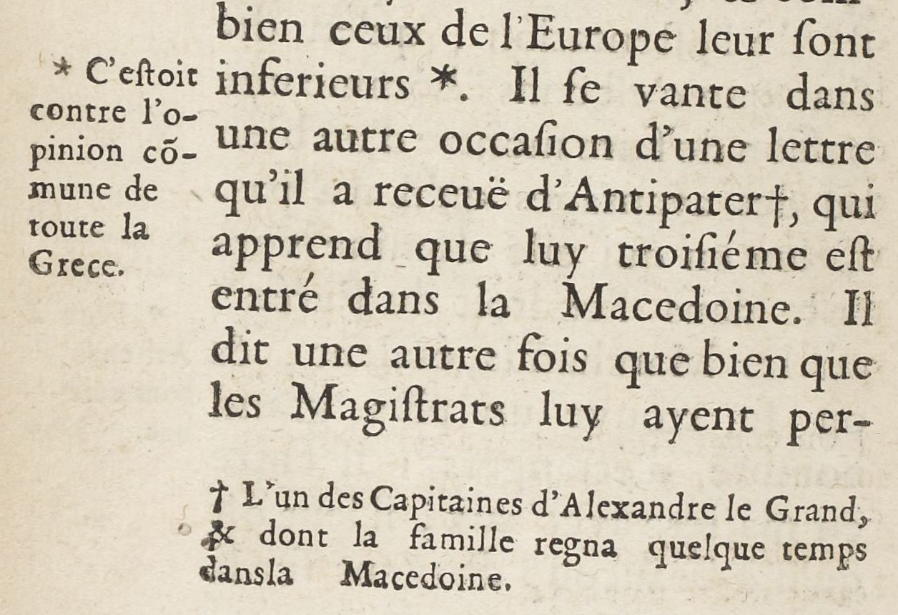
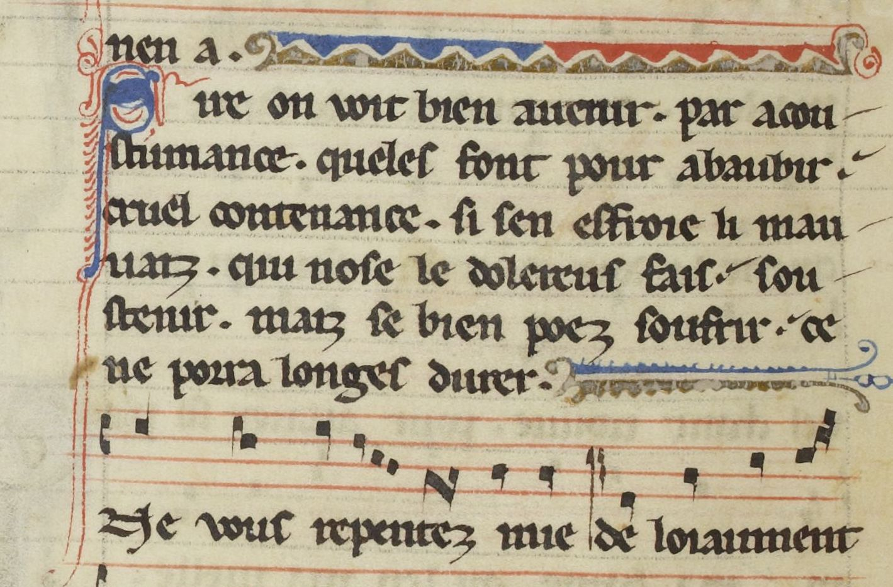
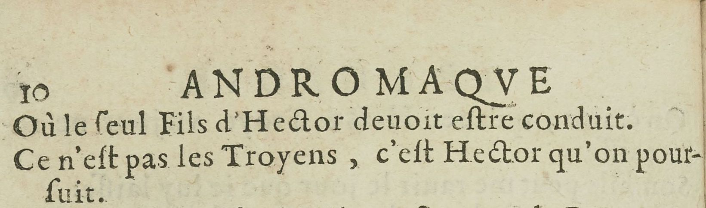
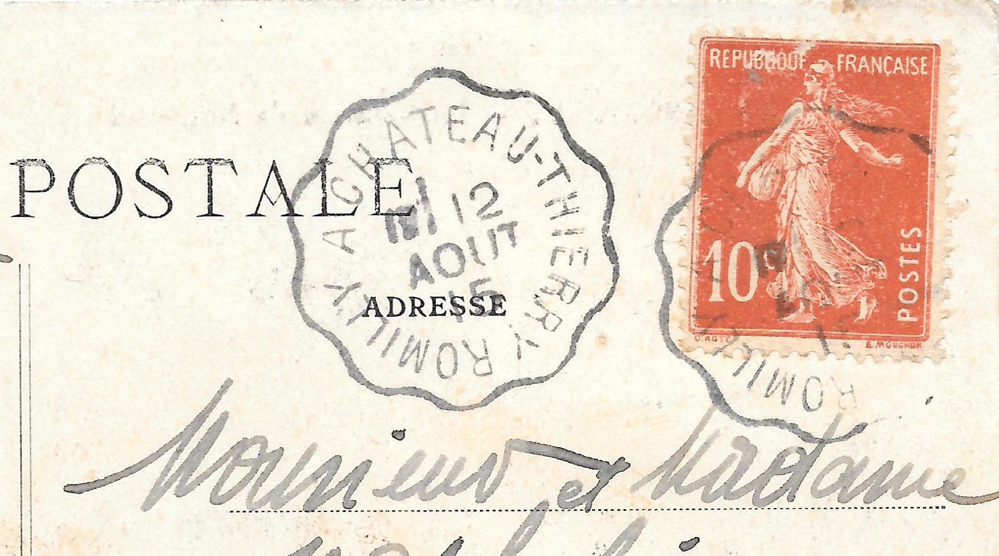
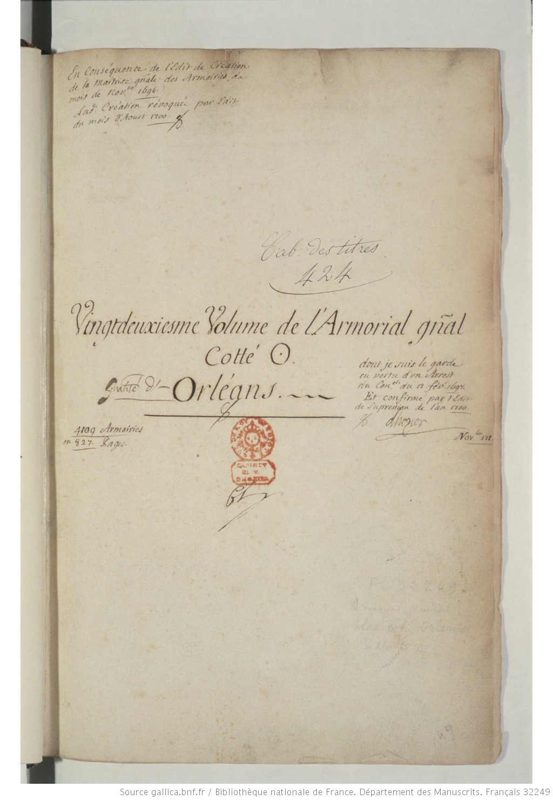
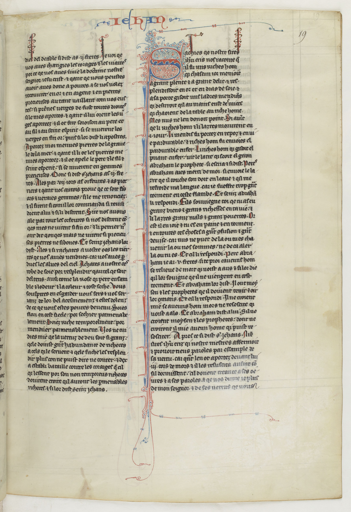

Numériser le patrimoine I: standards et bonnes pratiques

# L'analyse de mise en page

Simon Gabay
Genève

---

# _Pre-processing_

---

## Rotation

| Original 									  | Résultat							   |
|---------------------------------------------|----------------------------------------|
|  | |

---
## Niveau de gris

| Original 								| Résultat							   		|
|---------------------------------------|-------------------------------------------|
|  | |

---
## Binarisation

| Original 									 | Résultat							   		|
|--------------------------------------------|------------------------------------------|
|  | |

---
## Binarisations
Le principe de la binarisation d'une image esrt de déterminer un seuil: les pixels dont le niveau de gris est en dessous du seuil deviennent noirs, et ceux au dessus deviennent blanc.

On n'utilise plus de seuil global (i.e. pour la page) mais par exemple des seuils contextuels calculés à partir de la moyenne et de la cote z d'une fenêtre centrée sur le pixel. Il existe une multitude de techniques plus ou moins efficaces comme Niblack ou son amélioration par Sauvola (cf. image).

---
## Segmentation I

| Original 									| Résultat							   		   |
|-------------------------------------------|----------------------------------------------|
|  | |

---
## Segmentation: mise en page

---
## Segmentation: lignes

L'OCR fonctionnant au niveau des lignes, il est fondamental de les extraire au mieux. L'utilisation d'outil dédié à la segmentation, et non d'un segmenteur intégré à l'OCR, peut être intéressant

---
## Segmentation: la décoration

Le segmenteur peut extraire plus que des lignes: il peut extraire, par exemple, des ornements (bandeaux, initiales, culs-de-lampe…)

---

# Principes d'apprentissage machine

---
## L'apprentissage automatique

L'apprentissage machine (ou automatique) se fonde sur des approches mathématiques et statistiques pour donner aux ordinateurs la capacité d'« apprendre » à partir de données, c'est-à-dire d'améliorer leur performance à résoudre des tâches sans être explicitement programmés pour chacune.

Il existe plusieurs méthodes:
* Machines à vecteurs de support
* Méthodes statistiques
* Les réseaux de neurones
* …

---

## Apprendre pour une machine

Pour apprendre à une machine à faire quelque chose, on a deux possibilités:
1. Donner des règles à la machine: _suivons_ a pour lemme _suivre_. Le problème c'est qu'il existe des cas ambigus: _suis_? Il faut alors rajouter des règles toujours complexes
2. Donner des exemples à la machine, qui va déduire des règles à partir des exemples: _je suis un homme_ -> _être_ vs _je suis le cours_ -> _suivre_. Le problème c'est qu'il faut beaucoup d'exemple

Nous allons ici suivre la seconde méthode, qui est plus efficace. Il va donc nous falloir des exemples.

---
## Préparer un dataset
Il va nous falloir trois jeux de données:
* Pour l'entraînement: les données sont regardées par la machine pour déduire les règles
* Pour la validation: les données sont utilisées pour contrôler l'aprentissage sur les données d'entraînement à chaque itération, avec le risque que la machine se mette à bachoter
* Pour le test final: les données, qui n'ont jamais été vues pendant l'entraînement, vont permettre de contrôler la qualité finale

---
## Répartition du dataset

---
## Le règne de la quantité

L'IA est extrêmement gourmande en données: le plus c'est le mieux, il en faut donc un maximum. Il peut donc être utile de mutualiser les données, comme le propose le projet _HTR United_:

https://htr-united.github.io

Mais pour partager des données, il faut qu'elles soient compatibles entre elles, tant du point de vue du format que de l'annotation:
* On ne peut pas mélanger des données en ALTO et en PAGExml
* Si certains transcrivent _v_ et d'autres _u_ c'est potentiellement un problème
* Si certains distinguent les colonnes et d'autre pas ça ne va pas
* …

---
## Roadmap pour l'entraînement

---
## Petit lexique

* Modèle: somme de ce qui a été appris par la machine au cours de l'apprentissage
* Itération: cycle d'entrainement pendant le quel l'ordinateur voit toutes les données d'entraînement
* Surentraînement (_overfitting_): à force d'être évaluée sur le même jeu de validation à chaque itération, la machine se met à n'apprendre que pour passer ce test
* Généralisation: capacité du modèle à traiter des données qu'il n'a jamais vues.
* Arrêt prématuré (_early stopping_): arrêt de l'entraînement avant le surentraînement
* _Fine tuning_: on repart depuis un modèle déjà entraîné, auquel on ajoute une couche d'information

---
## Le résultat

On utilise pour évaluer un modèle un score dit "F1", calculé à partir de la précision (_precision_) et du rappel (_recall_):
* Le rappel calcule le nombre de positifs bien prédits par notre modèle.
* La précision calcule le nombre de prédictions positives bien effectuées.

On parle donc:
* De faux négatif, quand le résultat est déclaré positif mais est en réalité négatif. La machine s'est trompée.
* De vrai négatif, quand le résultat est déclaré négatif mais est en réalité positif. La machine a oublié quelque chose.

---
## Score F1

---
## IoU

On utilise aussi l'intersection sur l'union (_Intersection over union_), plus adapté pour des zones (sur une page par exemple).

---

---
## Sur le test
Le score du test n'a pas de valeur en soi, il dépend:
* Des données d'entraînement
* Des données dans le jeu de test

99% sur 10 000 images ne vaut pas (forcément) 99% sur 1000 images

Pour le test, on peut utiliser des données:
* _In domain_: elles sont proches du jeu d'entraînement (tirées du même livre par exemple)
* _Out of domain_: elles sont différentes du jeu d'entraînement -- la question étant de savoir jusqu'à quel point différentes

---
## Exercice

Regardez le dossier `Exercices` et tenter de trouver un dénominateur commun à toutes ces images

---

# _SegmOnto_

---
## Intuition

---
## Principes

Titre courant, numéro de page, corps du texte, initiale, rubrique...

Approche générale plutôt que spécifique

Mise en page plutôt qu’analyse sémantique

Une standardisation est cruciale pour la numérisation massive des documents qui s’annonce

---
## Double objectif

- Partager les données (_upstream_): l’intelligence artificielle a besoin de données: les équipes de recherche ont besoin de partager des documents annotés pour améliorer les résultats de l’HTR en augmentant la quantité de données d’entraînement
- Partager les données (_downstream_): les équipes de recherche ont aussi besoin de mettre en commun des post-traitement de données pour l’exploration des corpus et la production/transformation automatisée de documents (TEI, RDF...)

→ Trouver un vocabulaire partagé et contrôlé pour décrire la page

---
## Trouver un vocabulaire

Plutôt de créer un vocabulaire, il est préférable de s’appuyer sur de l’existant
- Vocabulaire PAGE xml, avec très peu de catégories
- Vocabulaire _Codicologia_, un vocabulaire multilingue pour la description des manuscrits, avec énormément de catégories, et adapté pour le RDF (Vocabulaire international de la codicologie - SKOS)

Liens:
- http://codicologia.irht.cnrs.fr/
- http://gams.uni-graz.at/archive/objects/o:voccod/methods/sdef:SKOS/get

---

## Zones

| Zones                      | Zones (suite)             |
|----------------------------|---------------------------|
| `CustomZone`               | `NumberingZone`           |
| `DamageZone`               | `QuireMarksZone`          |
| `DigitizationArtefactZone` | `RunningTitleZone`        |
| `DropCapitalZone`          | `SealZone`                |
| `GraphicZone`              | `StampZone`               |
| `MainZone`                 | `TableZone`               |
| `MarginTextZone`           | `TitlePageZone`           |
| `MusicZone`                |                           |

---
## Lignes

- `CustomLine`
- `DefaultLine`
- `DropCapitalLine`
- `HeadingLine`
- `InterlinearLine`
- `MusicLine`

---

## `CustomZone`
- Definition: characterises any kind of zone not fitting in the other categories, according to any convenient typology the user chooses.
- Subtypes: Any
- Examples: encoding catalogue entries with
  - `CustomZone:entry#1`
  - `CustomZone:entry#2`

---

## `DamageZone`

* Definition: characterises any area containing damage to the source, such as holes in the material (parchment, paper…), blots, etc.
* Subtypes: suggested values include:
  * `DamageZone:corrosion` (_corrosion_)
  * `DamageZone:hole` (_trou_)
  * `DamageZone:mold` (_moisissure_)
  * `DamageZone:peeled` (_desquamé_)
  * `DamageZone:soaked` (_détrempé_)
  * `DamageZone:scuffed` (_eraillé_)
…

---
## `DamageZone` 2
Examples:

| `DamageZone:soaked` 									| `DamageZone:hole`							   		   |
|-------------------------------------------|----------------------------------------------|
|  | |

Identifying damaged area might prove useful, as they can affect the result of text prediction.

---

## `DigitizationArtefactZone`

* Definition: it contains any type of item external to the document itself, but due to the process of digitisation, such as rulers or color tables added to help analyse the image.
* Subtypes: suggested values include:

| `DigitizationArtefactZone:testCard` 									| `DigitizationArtefactZone:ruler`							   		   |
|-------------------------------------------|----------------------------------------------|
|  | |

---

## `DropCapitalZone`

* Definition: contains any type of initial letter, occupying a space corresponding to several lines of the main text or bearing significant ornementation, be they historiated, ornated, flourished or painted initials (and excluding the following text line).

* Subtypes: suggested values include:

  * `DropCapitalZone:historiated`
  * `DropCapitalZone:floriate`
  * `DropCapitalZone:flourish`
  * `DropCapitalZone:voided`
  * `DropCapitalZone:parted`

---

## `DropCapitalZone`

  * `DropCapitalZone:champ`
  * `DropCapitalZone:facetted`
  * `DropCapitalZone:plain`
  * `DropCapitalZone:interlocked`

| Initiale manuscrite 									| initiale imprimée							   		   |
|-------------------------------------------|----------------------------------------------|
|  | |

---

## `GraphicZone`

* Definition: characterises a zone containing any type of graphic element, from purely ornamental  to consubstantial to the text (e.g., full page paintings, line-fillers, marginal drawings, figures, etc.).
* Subtypes: suggested values include:

  * `GraphicZone:illustration`
  * `GraphicZone:ornamentation`
  * `GraphicZone:figure`

---
## `GraphicZone`

| `GraphicZone:illustration` 								| `GraphicZone:ornamentation`							   		   |
|-------------------------------------------|----------------------------------------------|
|  |  |

| `GraphicZone:figure` 									    | `GraphicZone:figure`							   		   |
|-------------------------------------------|----------------------------------------------|
|  |  |

---

## `MainZone`

* Definition the main area (text column) designed to contain text, either as a single  or several columns (as designed in the conception of the layout: including eventually text, music notations, illumination, etc.).

* Subtypes: suggested values include:

| `MainZone:column` 								| `MainZone:column#1` and `MainZone:column#1`							   		   |
|-------------------------------------------|----------------------------------------------|
|  |  |

---

## `MarginTextZone`

* Definition: characterises any **text zone** contained in the margins (upper, lower, inner or outer), including the space between two columns, whatever their semantic status (gloss, additions, …).

* Subtypes: suggested values include:

  * `MarginTextZone:note`
  * `MarginTextZone:commentary`
  * `MarginTextZone:correction`
  * `MarginTextZone:variants`

---
## `MarginTextZone`

| `MarginTextZone` 								          | .                 							   		   |
|-------------------------------------------|------------------------------------------|
|  |  |

| `MarginTextZone:variantes` 			            | `MarginTextZone:variantes`			   		      |
|---------------------------------------------|---------------------------------------------|
|  |  |

---

## `MusicZone`

* Definition: characterises an area containing musical notations, such as neumes, staves, etc., with the possible inclusions of text.

* Subtypes: none

* Examples:

| `MusicZone` imprimée 			                  | `MusicZone` manuscrite    			   		      |
|---------------------------------------------|---------------------------------------------|
|     |     |

---

## `NumberingZone`

* Definitio: it characterises a zone containing the page number.

* Subtypes: suggested values include:
  * `NumberingZone:page`
  * `NumberingZone:other`

* Examples

| `NumberingZone:folio`             		      | `NumberingZone:page`    	    		   		    |
|---------------------------------------------|---------------------------------------------|
|     |  |

---
## `QuireMarksZone`

* Definition: characterises a zone containing a quire signature (i.e., _a ii_), catchword, or any kind of element relative to the material organisation of the source, with the exclusion of page numbers.

* Subtypes: suggested values include:
  * `QuireMarksZone:signature`
  * `QuireMarksZone:catchwords`

---
## `QuireMarksZone`
* Examples
  * `QuireMarksZone:signature`

  * `QuireMarksZone:catchwords`

| `QuireMarksZone` manuscrite            		  | `QuireMarksZone` imprimée   	   		     |
|---------------------------------------------|------------------------------------------|
|    |  |

---

## `RunningTitleZone`

* Definition: characterises a zone containing a running title.

* Subtypes: none

* Examples

| `RunningTitleZone` imprimée            	  | `RunningTitleZone` manuscrite   	   	    |
|-------------------------------------------|-------------------------------------------|
|   |  |

---

## `SealZone`

* Definition: it characterises a zone containing a seal.

* Subtypes: none

* Examples

---

## `StampZone`

* Definition: it characterises a zone containing a stamp, be it a library stamp or a mark from a postal service.

* Subtypes: suggested values include:
  * `StampZone:postal`
  * `StampZone:curatorial`

---

## `StampZone`

* Examples
  * `StampZone:curatorial`

* `StampZone:postal`

---

## `TableZone`

* Definition: characterises a zone containing a table of any kind.

* Subtypes: none

* Examples

| `TableZone`                           	  | `TableZone`                      	   	    |
|-------------------------------------------|-------------------------------------------|
|     |  |

---

## `TitlePageZone`

* Definition: it characterises a zone containing a title distinct from the main text. It is mainly used for prints.

* Subtypes: none

* Examples

| `TitlePageZone` manuscrite                | `TitlePageZone` imprimée              	  |
|-------------------------------------------|-------------------------------------------|
|     |     |

---
## `CustomLine`

* Definition: characterises any kind of line not fitting in the other categories, according to any convenient typology the user chooses.

* Subtypes: Any

* Justification: all projects have specific needs regarding types of lines peculiar to their sources or their goals and  not covered by the standard types.

---
## `DefaultLine`

* Definition: it characterises any kind of standard text line, whether they are included in the `MainZone` text, in the `MarginZone`, in `MusicZone`, or in any type of zone.

* Subtypes: none

* Examples

| `DefaultLine` imprimée                    | `DefaultLine` manuscrite              	  |
|-------------------------------------------|-------------------------------------------|
|  |   |

---
## `DropCapitalLine`

* Definition: characterises a line on which rests a [`DropCapital`](https://github.com/SegmOnto/examples/tree/main/zones/DropCapital).

* Subtypes: none

* Examples

| `DefaultLine` imprimée                    | `DefaultLine` manuscrite              	  |
|-------------------------------------------|-------------------------------------------|
|  |   |

* Justification: drop capitals are both specific zones, and bear a text.

---
## `InterlinearLine`

* . Definition: characterises a line that is not a standard text line, but as been added between two of them, for instance to include a forgotten word.

* Subtypes: suggested values include:

  - `InterlinearLine:commentary`
  - `InterlinearLine:correction`

* Examples

  - `InterlinearLine:correction`

---
## `MusicLine`

* Definition: caracterises the central line of a musical stave.

* Subtypes: none

* Examples

* Justification: analysis or prediction of musical content can be as necessary as the text's.

---
## `HeadingLine`

* Definition: characterises a line containing a rubric, for instance signalling the beginning of a new text.

* Subtypes: suggested values include:

  - `HeadingLine:incipit`
  - `HeadingLine:explicit`
  - `HeadingLine:title`

* Examples

---

# Exercice : créer un nouveau document

---
## La description du document (1)

Après avoir cliqué sur `Create new Document`, plusieurs éléments sont à préciser dans la partie *Description* :
- commencer par donner un nom à votre document ;
- *Main script* : Latin ;
- *Read direction* : *Left to Right* ;
- *Line offset* : *Baseline*
- *Metadata* : les métadonnées sont remplies automatiquement si vous choisissez de charger votre document via IIIF.

---
## La description du document

---
## Métadonnées remplies automatiquement via IIIF

---
## La description du document (2)

La dernière étape consiste à mettre à jour l'ontologie du document afin qu'elle corresponde à celle des deux modèles précédemment chargés :

*Region types* :
- ajouter manuellement *CustomZone*, *DamageZone*, *DigitizationArtefactZone*, *DropCapitalZone*, *GraphicZone*, *MainZone*, *MarginTextZone*, *MusicZone*, *NumberingZone*, *QuireMarksZone*, *SealZone*, *StampZone*, *TableZone* et *TitlePageZone* (15 éléments au total).

*Line types* :
- ajouter manuellement *CustomLine*, *DefaultLine*, *DropCapitalLine*, *InterlinearLine*, *MusicLine* and *HeadingLine* (6 éléments au total).
- Enfin, appuyer sur `Create`.

---
## L'ontologie

---

## La segmentation des images

---
## Images

---

## Regions

- Commencer par sélectionner l'ensemble des images que vous souhaitez segmenter ;
- Cliquer sur `Segment`;
- Le `Model` à utiliser est le modèle de segmentation par défaut (`blla.mlmodel`) ;
- Sélectionner `Regions` dans `Segmentation steps` ;
- Lancer la segmentation et patienter.

---
## Paramètres pour la segmentation par régions

---
## Exemple de résultat

---
## Corrections

- Vous pouvez à présent consulter les résultats de la segmentation en cliquant sur `Edit`.
- Le modèle par défaut n'étant pas familier de l'ontologie que nous souhaitons utiliser, il reste à associer chacune des zones repérées à la bonne terminologie.
- Il se peut qu'il soit nécessaire de redéfinir certaines zones, pour cela cliquer sur le petit ciseau pour passer en mode *édition*.

---
## Lines

Il reste à présent à repérer les lignes du document :
- sélectionner les images ;
- cliquer sur `Segment` ;
- le `Model` à utiliser est le modèle par défaut ;
- sélectionner `Lines Baselines and Masks` dans `Segmentation steps` ;
- lancer la segmentation ;
- vérifier que les lignes ont bien été reconnues.

N.B. : il est important de commencer par segmenter les pages par régions puis par lignes afin que ces dernières soient automatiquement associées à leurs zones.

---
## Corrections

- Vous pouvez à présent consulter les résultats de la segmentation en cliquant sur `Edit`.
- Le modèle par défaut n'étant pas familier de l'ontologie que nous souhaitons utiliser, il reste à associer chacune des lignes repérées à la bonne terminologie.
- Il se peut qu'il soit nécessaire de retracer certaines lignes, pour cela cliquer sur le petit ciseau pour passer en mode *édition*.

