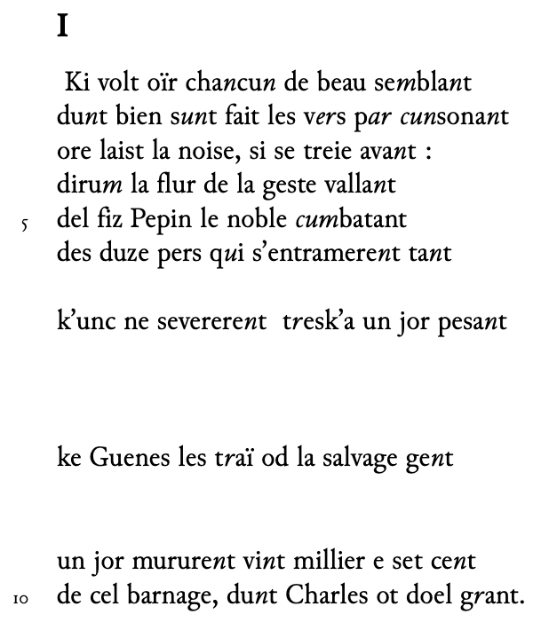
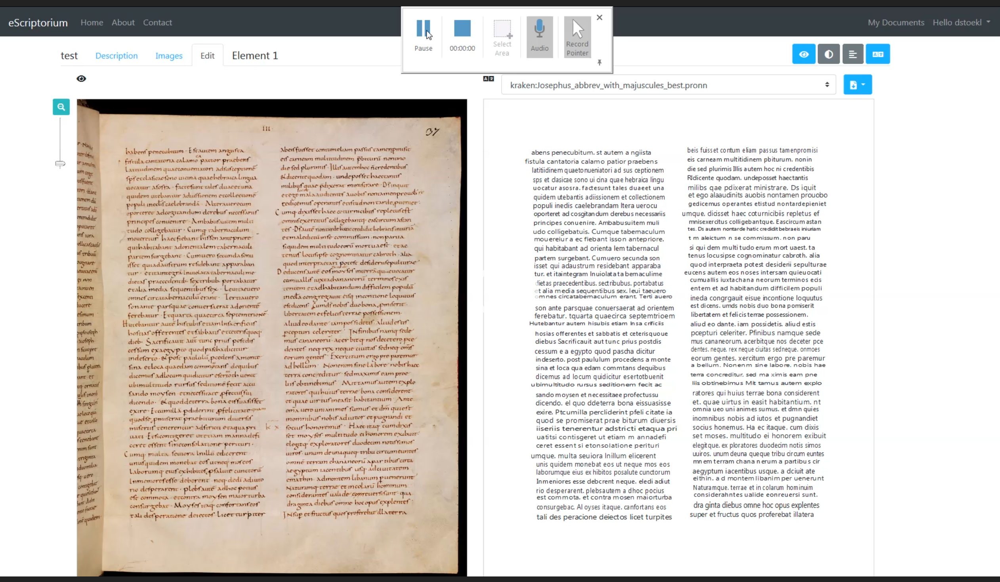

<style>
img[alt~="center"] {
  display: block;
  margin: 0 auto;
}
h1 {
  font-size: 46px;
  color: darkred;
}
h2 {
  font-size: 38px;
  color: darkred;
}
</style>

Numériser le patrimoine I: standards et bonnes pratiques

# Transcrire (automatiquement)

Simon Gabay

<a style="float:right; width: 20%;" rel="license" href="http://creativecommons.org/licenses/by-sa/4.0/"></a>

---

# Une nouvelle philologie?

---
## Editer (avant)

Ms Cologny, Fondation bodmer, Ms. 168


https://www.e-codices.unifr.ch/en/fmb/cb-0168/211r

---
## Editer (avant)

_Otinel, chanson de geste publiée pour la première fois, d'après les manuscrits de Rome et de Middlehill_, éd. F. Guessard et H. Michelant, Paris: Jannet, 1859


https://archive.org/details/floovantchanson00floogoog

---
## Editer (maintenant)

Camps, Jean-Baptiste, _La Chanson d'Otinel. Édition complète du corpus manuscrit et prolégomènes à l'édition critique_, Paris:Université de Paris-Sorbonne, 2016



https://halshs.archives-ouvertes.fr/tel-01664932

---
## Editer (maintenant)

Camps, Jean-Baptiste, _La Chanson d'Otinel. Édition complète du corpus manuscrit et prolégomènes à l'édition critique_, Paris:Université de Paris-Sorbonne, 2016


https://halshs.archives-ouvertes.fr/tel-01664932

---
## Niveaux de transcription


Transcription allographétique:

<span style="font-family:Junicode">Dūt bien ſt̄ faıt  leſ ủſ ꝑ ſonāt</span>

Transcription graphématique:

<span style="font-family:Junicode">Du<i>n</i>t bien s<i>un</i>t fait les v<i>er</i>s p<i>ar</i> <i>cun</i>sona<i>n</i>t</span>

Transcription modernisée:

<span style="font-family:Junicode">Dont bien sont fait les vers par consonant</span>

---
## Terminologie

Robinson et Solopova, "Guidelines for Transcription of the Manuscripts of the Wife of Bath’s Prologue", _The Canterbury Tales Project Occasional Papers 1_, 1993
- "Regularized": _all manuscript spellings are regularized to a particular norm_
- "Graphemic": _every manuscript spelling is preserved_
- "Graphetic": _every distinct letter-type is distinguished_
- "Graphic": _every mark in the manuscript, every space, is represented in the transcription, even to the point of decomposition of letter forms into discrete marks_

---
## Terminologie: précisions

Dominique Stutzmann, "Paléographie statistique pour décrire, identifier, dater... Normaliser pour coopérer et aller plus loin ?", _Kodikologie und Paläo-graphie im digitalen Zeitalter_, 2011.

"Si encoder, c'est décrire":
- "Graphique" et "graphétique" (ou de préférence "allographétique") décrivent l'image
- "Graphémique" (ou "graphématique") décrit le texte-objet soumis aux accidents
- "Regularisé" décrit le texte-idée

---
## Transcrire

<span style="font-family:Junicode">Dūt bien ſt̄ faıt  leſ ủſ ꝑ ſonāt</span>

est encodé:

```
Dūt bien ſt̄ faıt  leſ ủſ ꝑ ſonāt
```

On note:
- des lettres unicodes normales: `t` (`U+0074`)
- un caractère combiné: `t` + `◌̄` (`U+0074`+ `U+0304`)
- une lettre du domaine privé (MUFI): <span style="font-family:Junicode"></span> (`U+F1A6`), cf. [ici](https://mufi.info/m.php?p=muficharinfo&i=4772)

Pour afficher les cactères du domaine privé, on utilise des polices spéciales, comme `Junicode`, qui intègre la MUFI (et doit être installée)

```html
<span style="font-family:Junicode">le ủſ ꝑ son</span>
```

Pour installer Junicode: https://junicode.sourceforge.io/

---
## La _Medieval Unicode Font Initiative_ (MUFI)

On a tous connu le problème suivant: _expérience_ devrait s'afficher, mais c'est _expÚrience_ qui s'affiche. C'est une problème d'unicode.

Unicode est un standard informatique qui permet des échanges de textes dans différentes langues, à un niveau mondial.

La MUFI permet d'encoder des lettres médiévales (ou plus généralement rares) absentes d'Unicode: https://mufi.info

---
## Segmenter

Thibault Clérice,"Evaluating Deep Learning Methods for Word Segmentation of Scripta Continua Texts in Old French and Latin", _Journal of Data Mining and Digital Humanities_, Episciences.org, 2020


Doit-on conserver les agglutinations?
_⁊ aiſe de lauoir de ceſt ſiecle. ne en euſ nōt_

ou bien doit-on désagglutiner?

_⁊ aiſe de l'auoir de ceſt ſiecle. ne en euſ n'ōt_

---
## De nouvelles pratiques

Les possibilités de transcription n'ont jamais été aussi vastes:
- devons-nous continuer comme avant avec du semi-diplomatique, voire une transcription interprétative?
- doit-on exploiter au maximum les possibilités offertes par le numérique?
- doit-on faires les deux?

Cela dépend évidemment de plusieurs paramètres:
- mes questions de recherche
- mes compétences personnelles
- mes moyens financiers

C'est un exemple du tournant épistémologique majeur que constitue le numérique, et non une simple informatisation des pratiques anciennes

---
# Entraînement

---
## Transcrire (I)
Ligne de commandes + interface dans un navigateur


---
## Transcrire (II)
_Transkribus_ (Innsbruck)


---
## Transcrire (III)
_eScriptorium_ (EPHE/PSL)



--- 

## Création d'une vérité de terrain (_ground truth_)

Les images transcrites sont alors associées à leur transcription


---
## Entraînement (I)

Comme c'est du _machine learning_, on va répéter l'entraînement une multitude de fois (on parle d'_epochs_, de _stages_ …). À chaque fois un modèle est créé: celui qui permforme le mieux est conservé


---
## Entraînement (II)


---
## Scores

* On parle de CER (_Character Error Recognition_) et parfois de WER (_Word Error Recognition_).
* Distance de Levenshtein : combien d’opérations pour retrouver le résultat attendu (par exemple entre tonte et toute )?
* <p style="color:red">Une seule lettre fausse crée un mot faux ! Le WER est donc toujours supérieur au CER !</p>
* Ces scores peuvent être calculés sur deux jeux de données :
	* Le train set (on OCRise les images qui servent pour l’entraînement)
	* Le test set (on OCRise des images qui n’ont pas servi pour l’entraînement)
---
## L'amélioration des scores: données artificielles

* Avec Baskerville


* Avec IM FELL English SC


* Avec JSL Ancient


* Avec Chapbook


---
## L'amélioration des scores: bruit

* Original


* Bruit faible


* Bruit fort


---
## L'amélioration des scores: modification du cadre

* Cadre normal


* Cadre élargi


