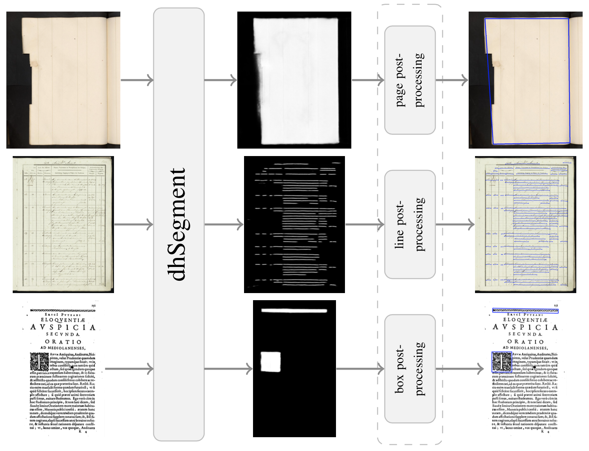
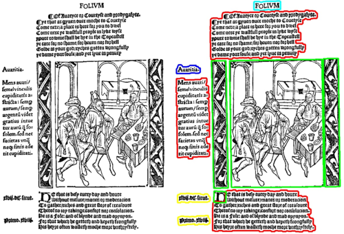
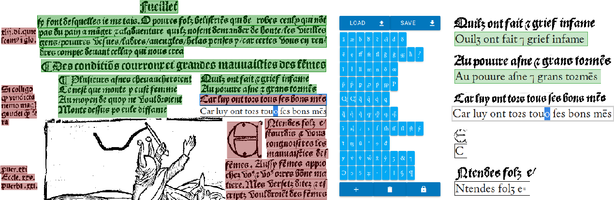
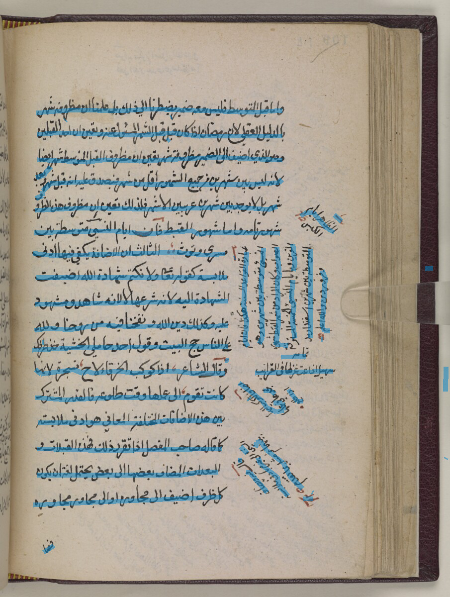
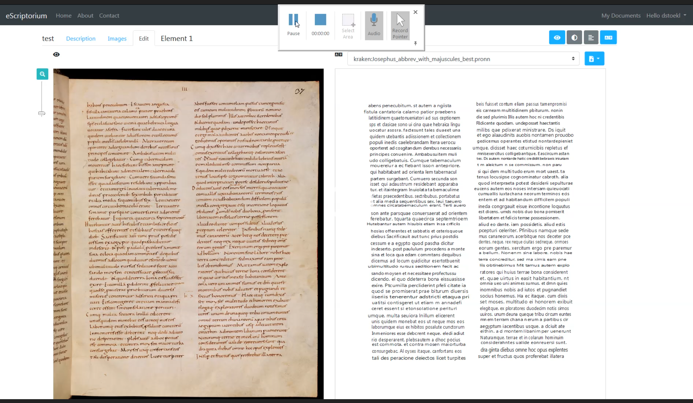

<style>
img[alt~="center"] {
  display: block;
  margin: 0 auto;
}
h1 {
  font-size: 46px;
  color: darkred;
}
h2 {
  font-size: 38px;
  color: darkred;
}
</style>

Numériser le patrimoine I: standards et bonnes pratiques 

# Exporter

 Simon Gabay

<a style="float:right; width: 20%;" rel="license" href="http://creativecommons.org/licenses/by-sa/4.0/"></a>

---

# Formats

---
## Données

Il faut réussir décrire les documents OCRisés, afin de reconstruire l'apparence originelle sur la base des informations conservées. On privilégie pour cela des documents XML, _page driven_.

```{xml}
<document>
  <page>
    <zone>
      <ligne coordonnées="points">
        <mot coordonnées="points">exemple</mot>
      <ligne>
    </zone>
  </page>
</document>
```
---
## Données

Afin de faire le lien entre l'image et le texte, on doit donner une information géométrique. Celle-ci peut être de trois ordres: ligne, bloc, ou polygone.

Il existe des documents de niveau page, paragraphe, ligne ou mot.

Il existe aussi plusieurs formats: hOCR, Alto, PageXML… Ces formats sont normalement utilisés avec METS (_Metadata Encoding and Transmission Standard_) pour la description de l'objet numérisé.


---
## Exemple 1: Alto

ALTO: _Analyzed Layout and Text Object_

Développé lors du projet européen METAe (_Meta  Data  engine_, 2000-2003) et publié en 2004

Trois éléments centraux:
* ```<Description>``` contient les métadonnées
* ```<Styles>``` contient le texte 
	* ```<TextStyle>``` contient les informations sur les fontes (famille, type, taille…)
	* ```<ParagraphStyle>``` contient la description des paragraphes (alignement gauche/droite, intelrigne)
* ```<Layout>``` contient le contenu, divisé en ```<Page> ```

---
```{xml}
<?xml version="1.0"?>
<alto>
    <Description>
        <MeasurementUnit/>
        <sourceImageInformation/>
        <Processing/>
    </Description>
    <Styles>
        <TextStyle FONTSIZE="10.0"/>
        <ParagraphStyle ALIGN="Left"/>
    </Styles>
    <Layout>
        <Page ID="P1" WIDTH="123" HPOS="123" VPOS="123">
          <PrintSpace WIDTH="123" HPOS="123" VPOS="123">
            <TextBlock ID="P1_TB1"  WIDTH="123"…>
              <TextLine WIDTH="123" HPOS="123"…>
                <String WIDTH="123"… CONTENT="Un">
                <sp WIDTH="123" HPOS="123" VPOS="123">
                <String WIDTH="123"… CONTENT="Exemple">
              </TextLine>
            </TextBlock
          </PrintSpace>
        </Page>
    </Layout>
</alto>
```

---
## Exemple 2: PageXML

PAGE: _Page Analysis and Ground-truth Elements_

Format créé lors du projet IMPACT EU (2010)

Contraiement à l'ALTO, PageXML conserve des informations sur le _pre-processing_ (binarisation,  deskew,  dewarping…) et l'évaluation du layout.

---

```{xml}
<PcGts>
  <Metadata>...</Metadata>
  <page>
    <TextRegion type="paragraph" id="r_1">
      <Coords points="1474,486 3684,486 3684,900…">
      <TextLine id="l_1">
        <Coords points="1475,487 3683,487 3683,635…">
        <Baseline points="1475,635 1587,635 2061…">
        <Word id="w1">
          <Coords points="1475,497 1587,497 1587…"/>
          <TextEquiv>
            <Unicode>Un</Unicode>
          </TextEquiv>
        </Word>
        <Word id="w2">
          <Coords points="1935,497 2061,497 2061,619…"/>
          <TextEquiv>
            <Unicode>exemple</Unicode>
          </TextEquiv>
        </Word>
        <TextEquiv>
          <Unicode>Un exemple</Unicode>
        </TextEquiv>
  </page>
</PcGts>
```
---
## Exemple 3: hOCR

Format XML _embedded_ dans du XHTML/HTML
Trois grandes classes associées aux éléments html ```<div>```, ```<p>```, ```<span>```
* ```ocr_page```  pour les pages
* ```ocr_par``` pour les paragraphes
* ```ocrx_line``` pour les lignes
* ```ocrx_word``` pour les mots

L'information géométrique est stockée dans une bbox

---
```{xml}
<?xml version="1.0" encoding="UTF-8"?>
  <html xmlns="http://www.w3.org/1999/xhtml">
    <head>
      <title></title>
      <meta name='ocr-system' content='tesseract'/>
    </head>
    <body>
      <div class='ocr_page' id='page_1'
           title='bbox 0 0 1926 3102'>
        <div class='ocr_carea' id='block_1_1'
             title="bbox 638 108 756 147">
          <p class='ocr_par' id='par_1_1' lang='eng'
             title="bbox 638 108 756 147">
            <span class='ocr_line' id='line_1_1'
                  title="bbox 638 108 756 147;
                         baseline 0 0">
              <span class='ocrx_word' id='word_1_1'
                    title='bbox 638 108 756 147'>
                exemple
              </span>
            </span>
          </p>
        </div>
      </div
    </body>
```

---
# Dans la jungle des outils

---

## Outils
* Tesseract
* Ocropy
* Kraken
* Calamari
* DHsegment
* …

Il est souhaitable de préférer une solution qui intègre les différentes étapes nécessaires à l'OCrisation

---

## DHsegment



Sofia Ares Oliveira, Benoit Seguin, Frederic Kaplan, "dhSegment: A generic deep-learning approach for document segmentation", v.2, [arXiv:1804.10371](https://arxiv.org/abs/1804.10371)

---

## Larex



Reul, C., Springmann, U., and Puppe, F., "LAREX - A semi-automatic open-source Tool for Layout Analysis and Region Extraction on Early Printed Books",  [arXiv:1701.07396](https://arxiv.org/abs/1701.07396)

---

## OCR4all



Reul C, Christ D, Hartelt A, Balbach N, Wehner M, Springmann U, Wick C, Grundig C, Büttner A, Puppe F. "OCR4all—An Open-Source Tool Providing a (Semi-)Automatic OCR Workflow for Historical Printings". _Applied Sciences_. 2019; 9(22):4853. [DOI: 10.3390/app9224853](https://doi.org/10.3390/app9224853)

---
## Kraken



Kiessling, B., Stökl Ben Ezra, D., Miller M., "BADAM: A Public Dataset for Baseline Detection in Arabic-script Manuscripts", HIP@ICDAR 2019. [arXiv:1907.04041](https://arxiv.org/abs/1907.04041)

---
## eScriptorium



Kiessling, B.; Tissot, R., Stökl Ben Ezra, D., Stokes P. "eScriptorium: An Open Source Platform for Historical Document Analysis", _OST@ICDAR_ 2019 (2019) [https://ieeexplore.ieee.org/document/8893029](https://ieeexplore.ieee.org/document/8893029/)

---

## _Pipeline_

Il existe plusieurs solutions qui articulent tous les éléments nécessaires pour l'OCRisation
* Web: [eScriptorium](https://scripta.psl.eu/en/)
* Docker: [ocr4all](https://github.com/OCR4all)
* Java: [Transkribus](https://transkribus.eu/Transkribus/)

---

## _Pipeline_ : Comment choisir?

Il existe plusieurs solutions qui articulent tous les éléments nécessaires pour l'OCRisation
* Web: [eScriptorium](https://scripta.psl.eu/en/), <span style="color:green">_open source_</span>
* Docker: [ocr4all](https://github.com/OCR4all), <span style="color:green">_open source_</span>
* Java: [Transkribus](https://transkribus.eu/Transkribus/), <span style="color:red">non _open source_</span>

---

# Après l'OCR: vers la TEI