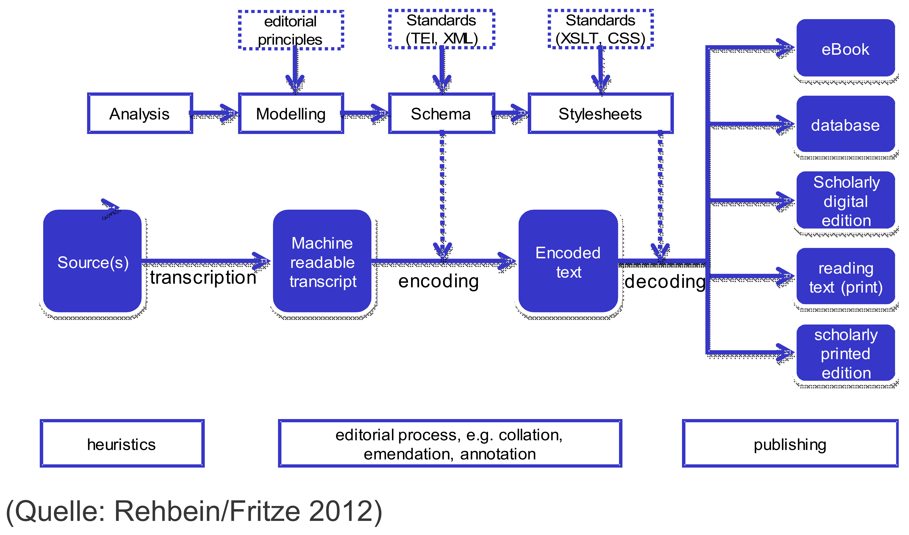

Numériser le patrimoine I: standards et bonnes pratiques

# Les Bonnes pratiques

Simon Gabay
Genève, 22 septembre 2020

---
# Introduction

---
## .* virtuelles

Les données patrimoniales concernent notamment
* Le texte
* L'image fixe
* L'image animée
* Le son

Il serait impossible de tout couvrir dans un seul cours, nous nous proposons donc de nous intéresser au patrimoine littéraire ancien en tant qu'objet (manuscrit, imprimé…). 

Les enjeux posés par la numérisation des fonds patrimoniaux des bibliothèques reste néanmoins très similaires à ceux d'autres institutions similaires. On parle ainsi de _GLAM_, (_galleries, libraries, archives, museums_).

---
## Au delà de l'interface

Dans la pratique, la confrontation avec le patrimoine numérisé consiste essentiellement en la consultation de sites. Est-ce agréable à consulter? Voire joli? Est-ce pratique à utiliser? Trouve-t-on l'information facilement? Pourrait-on proposer des services aux utilisateurs?

Les spécialistes des humanités numériques et les informaticiens s'intéressent beaucoup à l'utilisation des applications en ligne qu'ils développent. On parle ainsi d'_interface_, d'_intéraction homme-machine_ ou d'_expérience utilisateur_. 

Au delà de ces questions évidentes (et importantes), il existe un autre problème plus technique: celui de l'intéropérabilité des données, de leur standardisation, de le pérennisation… C'est un versant plus technique sur lequel nous aimerions nous pencher dans ce cours.

Prenons un exemple, celui d'[e-codices](https://www.e-codices.unifr.ch/fr/searchresult/list/one/fmb/cb-0040).

---


---


---
## _Under the hood_

```xml
<sourceDesc>
  <bibl>PDF vorhanden</bibl>
  <msDesc xml:lang="fra" xml:id="fmb-cb-0040">
    <msIdentifier>
      <settlement>Cologny</settlement>
      <repository>Fondation Martin Bodmer</repository>
      <idno>Cod. Bodmer 40</idno>
    </msIdentifier>
    <head>
      <title>
        <persName role="author" key="pnd_118660454">Jean Bodel</persName>
        , Chanson des Saisnes
      </title>
      <origDate notBefore="1270" notAfter="1299">Fin du XIIIᵉ siècle.</origDate>
    </head>
    <msContents>
      <msItem>
        <locus from="1r" to="122v">Ff. 1-122v°</locus>
        <author key="pnd_118660454">Jean Bodel</author>
        <title>Chanson des Saisnes</title>
```

---
## Bonnes pratiques

Numériser n'est pas compliqué, le faire dans les règles de l'art l'est beaucoup plus. Il s'agit donc de comprendre la raison de ces règles et d'apprendre à les appliquer.

Ces "bonnes pratiques" sont compliquées à suivre, car elles impliquent de suivre des règles génériques, et donc qui ne sont pas spécifiquement adaptées à nos problèmes. C'est un effort supplémentaire dans un premier temps, mais cela simplifie considérablement le travail par la suite: c'est cela, les humanités numériques.

---
# Points de repère

---
## Les standards

Il est fondamentale de suivre, autant que possible, des standards. Par exemple:

* ISO (_International Organization for Standardization_): Organisation internationale de normalisation
* Unicode (ISO/CEI 10646) pour le codage de texte écrit
* DC (_Dublin core_, ou ISO_15836) est un socle commun d'éléments descriptifs (auteur, date, lieu…)
* TEI (_Text Encoding Initiative_): recommandations pour l’encodage de documents textuels. Il existe un équivalent pour la musique (MEI).

---
## Les métadonnées

Les métadonnées accompagnent les données qu'elles enrichissent, parfois dans un fichier apparenté à la donnée (image), parfois à l'intérieur même des données (transcription)

* Les métadonnées _techniques_ sont souvent générées automatiquement par l'appareil qui produit la donnée (paramètres de prise de vue, réglage de l'appareil…)
* Les métadonnées _descriptives_ ciblent le contenu du document. Elles décrivent le contenu (auteur, titre, date…)

---
Exemple des métadonnées _Dublin core_ au format XML d'un portrait photographique de Zora Neale Hurston (l'orginal se trouve [ici](https://www.loc.gov/resource/van.5a52142)).

```xml
<!DOCTYPE dublinCore PUBLIC '-//OCLC//DTD Dublin core v.1//EN'>
<dublinCore>
  <title>[Portrait of Zora Neale Hurston]</title>
  <author type='photographer'>Van Vechten, Carl</author>
  <otherAgent type='digitizer'>Any Library</otherAgent>
  <subject scheme='gmgpc'>Portrait Photographs</subject>
  <objectType>image</objectType>
  <form scheme='IMT'>image/jpeg</form>
  <relation type='ammemParent'>vanv</relation>
  <identifier type='URN'>hdl:loc.pp.vanv/5a52142</identifier>
</dublinCore>
```

---
## Les formats

Une donnée numérique est enregistrée dans un format qui implique une déformation plus ou moins grande, et donc un poids plus ou moins important. Les formats diffèrent selon les types de données:

* Texte: `.xml`, `.doc`, `.docx`…
* Image: `.tiff`, `.jpg`, `.png`…
* Video: `.avi`, `.mp4`, `.mpeg`…
* Audio: `.mp3`, `.wav`…

Il existe des formats propriétaires (`.doc`) et des formats ouverts (`.docx`), des formats dépréciés et des nouveaux…

---
## Partager

De plus en plus on tente de construire des ponts entre les projets. On distingue ainsi le lieu où les données sont stockées et celui où l'on peut la trouver, voire la réutiliser:

* OAI-PMH (_Open Archives Initiative Protocol for Metadata Harvesting_)
* IIIF (_International Image Interoperability Framework_) pour l'interopérabilité pour la diffusion et l'échange d’images haute résolution sur le Web
* DTS (_Distributed Text Services_) pour l'interopérabilité pour la diffusion et l'échange de transcriptions sur le Web

---
Si l'on reprend notre manuscrit de la Bodmer, il est possible de récupérer toutes les images avec le lien suivant:

```console
https://www.e-codices.unifr.ch/metadata/iiif/fmb-cb-0040/manifest.json
```

En allant sur un autre site que celui de la Bodmer, par exemple celui de la BNF (https://demos.biblissima.fr/mirador/), on peut afficher les images suisses, qui restent stockées à Genève.

---

Extrait du manifest IIIF (au format JSON):

```json
{
    "canvases": [
        {
            "@id": "https://www.e-codices.unifr.ch/metadata/iiif/fmb-cb-0040/canvas/fmb-cb-0040_e001.json",
            "@type": "sc:Canvas",
            "label": "Front cover",
            "height": 6496,
            "width": 4872,
            "images": [
                {
                    "@id": "https://www.e-codices.unifr.ch/metadata/iiif/fmb-cb-0040/annotation/fmb-cb-0040_e001.json",
                    "@type": "oa:Annotation",
                    "motivation": "sc:painting",
                    "on": "https://www.e-codices.unifr.ch/metadata/iiif/fmb-cb-0040/canvas/fmb-cb-0040_e001.json",
                    "resource": {
                        "@id": "https://www.e-codices.unifr.ch/loris/fmb/fmb-cb-0040/fmb-cb-0040_e001.jp2/full/full/0/default/jpg",
                        "@type": "dctypes:Image",
                        "format": "image/jpeg",
                        "height": 6496,
                        "width": 4872,
                        "service": {
                            "@context": "http://iiif.io/api/image/2/context.json",
                            "@id": "https://www.e-codices.unifr.ch/loris/fmb/fmb-cb-0040/fmb-cb-0040_e001.jp2",
                            "profile": "http://iiif.io/api/image/2/level2.json"
                        }
                    }
                }
            ]
        }
    ]
}
```

---
## Les référentiels

Les entités uniques, comme les personnes, les lieux, les objets… peuvent avoir des identifiants uniques permettant de faciliter la réutilisation et la connection des données entre les projets:
* ISNI (_International Standard Name Identifier_) pour les personnes
* GeoNames pour les noms de lieux
* ISMI (_International Standard Manuscript Identifier_) pour les manuscrits, sur le modèle de l'ISBN

---

Fiche GeoNames de Genève (https://www.geonames.org/2660646)


---
## Les droits

On utilise des licences qui permettent de protéger son travail, et de respecter celui des autres. Est-ce que je peux:

* Vendre des données en ligne?
* Modifier les données que j'ai trouvées?
* Diffuser des données sans indiquer la source?
* Diffuser ces données sous une autre forme que je les ai trouvés?

Il existe plusieurs solutions:
* Creative commons
* Etalab
* MIT
* …
* 
---

Exemple de licence sur [Wikipedia](https://fr.wikipedia.org/wiki/Fichier:Mona_Lisa,_by_Leonardo_da_Vinci,_from_C2RMF_retouched.jpg):


---


---
## Diffuser les données

Réaliser techniquement un projet ne suffit pas: il faut préparer la distribution et la conservation des données, surtout dans une démarche _open_.

* Documenter: il faut expliquer comment s'organisent les données pour que n'importe qui (ou presque) puisse (idéalement) remonter le projet
* Distribuer: il existe différentes options comme le logiciel (payant?) et l'application en ligne (gratuite? mais qui paye?). Il faut faire attention aux langages de programmation utilisés (Python ou Angular?) et différencier la publication de l'application et du code de l'application avec les données
* Entreposer: il faut s'organiser pour que nos données nous survivent en utilisant des entrepôts sécurisés pour les données (type Zenodo) ou les publications (type HAL)

---

## _FAIR_


---
* F (_findable_) car les données doivent être facilement trouvables, par un permalien par exemple et des métadonnées pour les moteurs de recherche
* A (_Accessible_) car les données doivent être récupérables par un protocole de communication (IIIF, OAI-PMH…), assorties d'une licence claire, et avec des données accessibles si les données sont sous embargo
* I (_Interoperable_) car les données doivent suivre des standards connus
* R (_Reusable_) car les données doivent autant que possible être réutilisable, notamment grâce à une documentation claire, en plus des points précédemment évoqués (standards, métadonnées…)

---
## _Open_

L'_open science_ est un enjeu fondamental, tant d'un point de vue numérique que scientifique. 

* _open access_: 
* _open source_: 
* _open data_: 
* _etc._

L'intérêt de la démarche _open_ est citoyen (gratuité) mais aussi scientifique (reproductibilité, garantie qualité).

---
# Chaîne de traitement

---
## Chaîne de traitement

On parle de chaîne de traitement (ou "flux de travail" selon la Commission générale de terminologie et de néologie) ou de _workflow_.
Comme aucune solution informatique ne permet de tout faire (à l'inverse de logiciel comme _Word_ en bureautique), il faut trouver
1. Une série de solutions…
2. … qui s'articulent correctement les unes avec les autres…
3. … et qui correspondent à des standards.

---
## Pourquoi dois-je (presque) tout faire?

L'objectif d'avoir un équivalent de _Word_ n'est pas nécessairement souhaitable. Toute simplification se paye:
- Au sens propre avec l'apparition de solutions privées, donc payantes.
- Au sens figuré, avec l'enfermement dans une solution générale qui gère mal les cas particuliers.

Cependant, il existe déjà des chaînes de traitement fonctionnelles et de très grande qualité, comme [METOPES](http://www.numedif.fr/metopes.html) à l'université de Caen.

---
## Un exemple de chaîne de traitement pour l'édition numérique



Source: Christof Schöch, _Digitale Textedition mit TEI_, [en ligne](https://de.dariah.eu/tei-tutorial).

---
## La place du numérique dans les discipline

L'édition numérique reprend les étapes de la philologie traditionnelle. Elle ouvre de nouvelles potentialités, malheureusement au prix d'une complexification du travail.

Retour à la renaissance, ou, comme Alde Manuce, l'humaniste maîtrise l'intégralité de la chaîne de production, de la transcription à la publication, en passant par la fabrication des outils (presse, fontes…).

L'édition numérique est avant tout une édition, et nécessite des compétences en ecdotique traditionnelle.

---
## Quelques grandes étapes

1. Transcription -> Kraken, Ocropy, Tesseract…
2. Collation -> Collatex, Juxta…
3. Analyse paléographique -> Archetype…
4. Annotation linguistique -> TreeTagger, Marmot, Pie…
5. Exploitation linguistique -> TXM, Unitex/GramLab…
6. Exploitation littéraire -> Pour les emprunts: Tracer ou Philologic
7. Indexation -> HER, GROBID entity fishing…
8. Publication -> TEIPublisher, Synoptix, LaTeX
9. Archivage -> HAL, Huma-num

___
# Bibliographie

* Huma-num, _Le guide de bonnes pratiques numériques_, version de 2015,  https://www.huma-num.fr/sites/default/files/guide_des_bonnes_pratiques.pdf
* _Numériser et mettre en ligne_, sous la dir. de Thierry Claerr et Isabelle Westeel, Presses de l'Enssib, 2010. https://books.openedition.org/pressesenssib/414