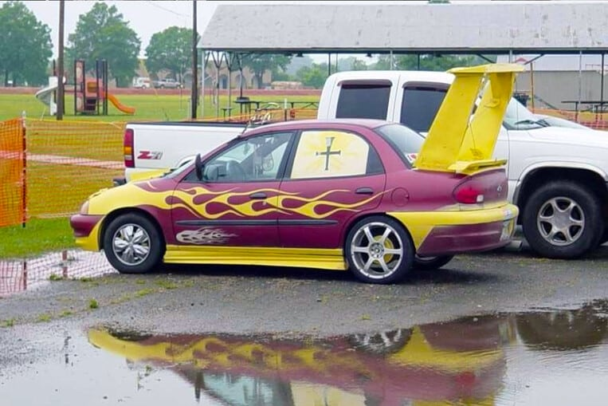
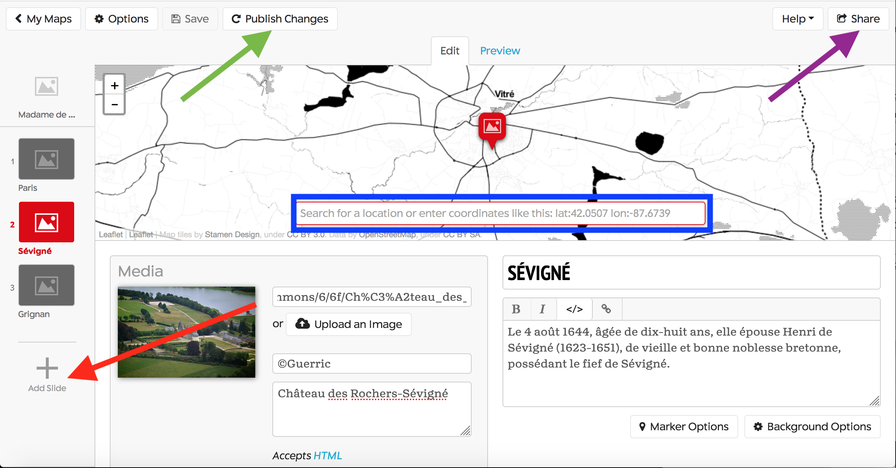
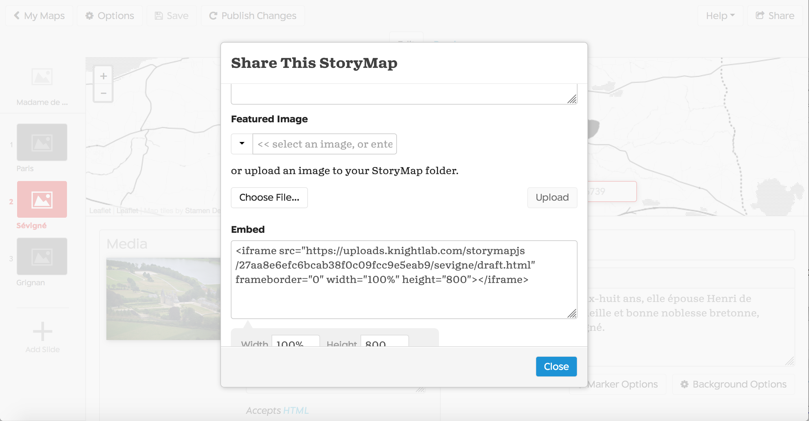
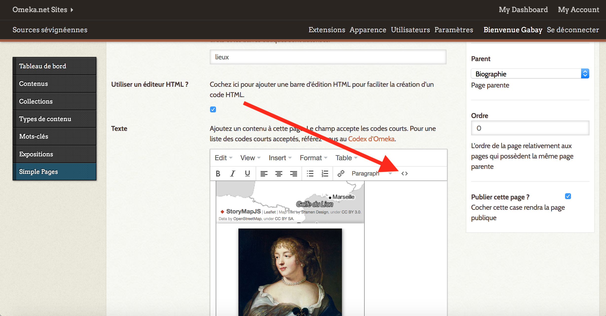
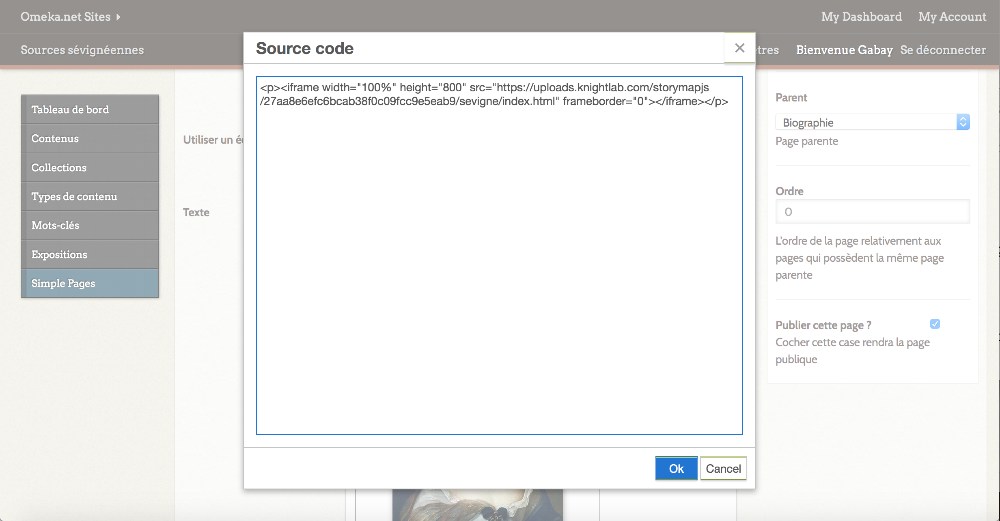
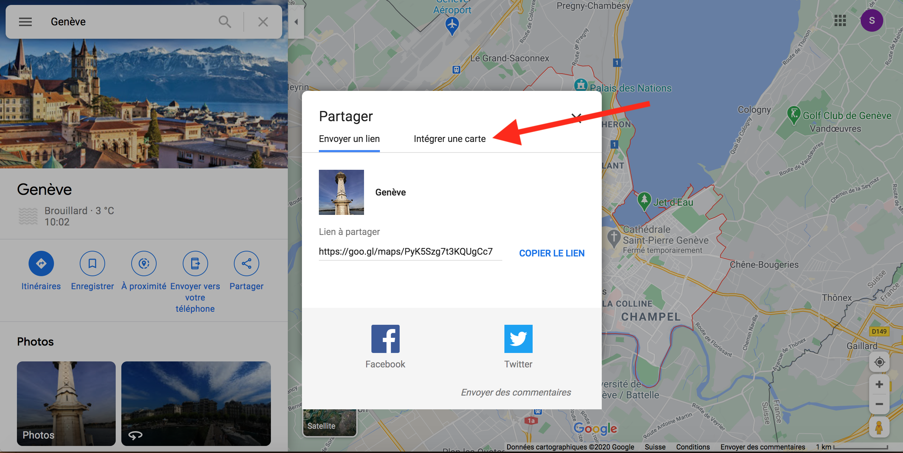
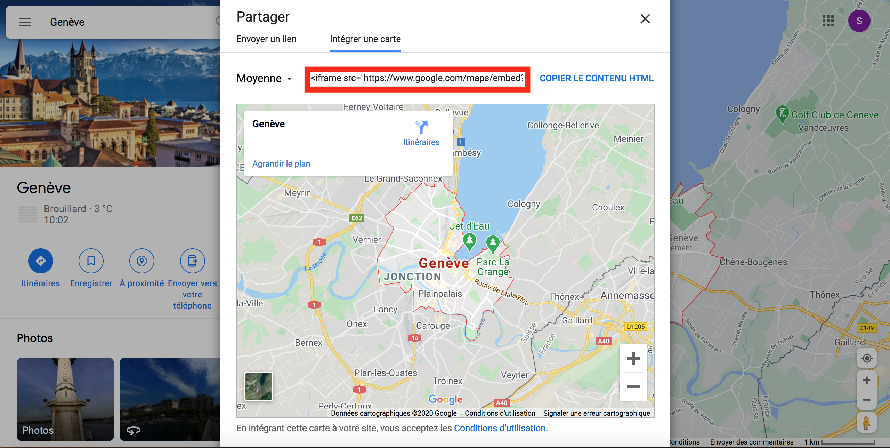
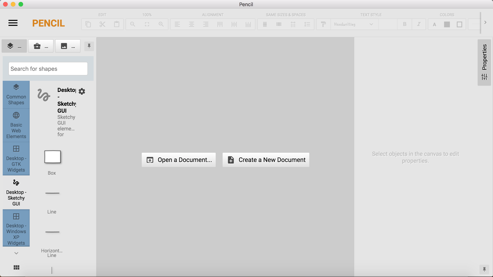
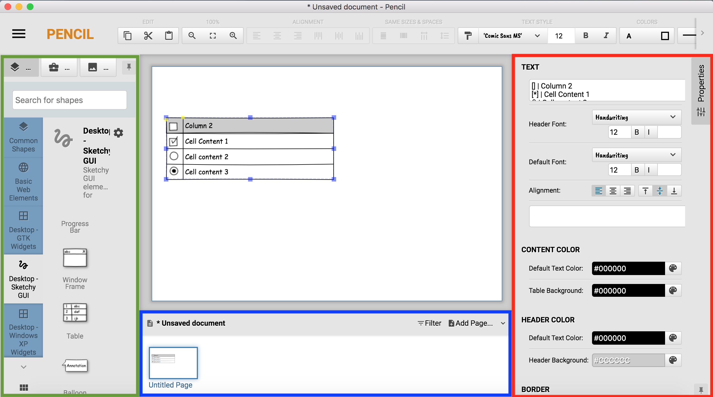

Formation Edition numérique

# Customisation de sites

Simon Gabay

---

---
## StoryMapJS

StoryMapJS: https://storymap.knightlab.com

* Vous pouvez ajouter des slides à gauche (flèche route)
* Le lieu est ajouté dans la barre bleue (tapez le nom de la ville ou bien ajoutez directement les coordonnées)
* Si vous avez déjà enregistré votre StoryMap, pensez à publier d'éventuels changements (flèche verte)
* Pour partager votre document, choisissez _Share_ (flèche violette)

* Si vous voulez publier votre carte sur omeka, récupérez l'`<iframe/>` et ajoutez le dans votre page directement dans le code (flèche rouge).

---
## TimeLineJS

Le principe est sensiblement le même que précédemment, sauf qu'il vous faut en plus passer par Google docs.

Vous pouvez utiliser le service en ligne _TimeLineJS_: https://timeline.knightlab.com

---
## Maps

---

## Mock up

Rappelez-vous le [cours 5](https://github.com/gabays/NumPat_1/blob/master/NumPat_1_5/NumPat_1_5.md), nous avions vu  qu'il était préférable de faire un _mock up_, c'est-à-dire un dessin préparatoire du site, avant de se lancer dans le développement. Il existe des logiciels pour cela.

Il existe un logiciel gratuit:  Pencil (https://pencil.evolus.vn)

Il existe aussi des logiciels en ligne (plus ou moins) gratuits (https://www.lucidchart.com/pages/fr/exemple/mockup-en-ligne)

* La partie en vert permet de sélectionner le type de dessin que nous allons faire
(il est ainsi possible de faire un _flowchart_, ou de dessiner des applications Windows…).
* La partie en bleu permet de dessiner les différentes pages qui vont constituer notre site.
* La partie en rouge permet de redessiner les objets génériques sélectionnés à gauche.
