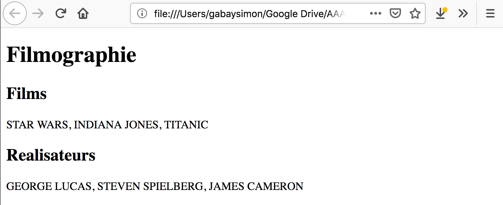

Numériser le patrimoine I: standards et bonnes pratiques

# Langages

Simon Gabay
Genève

---
# Langages et vocabulaires

---
## Langages

Il existe plusieurs langages de programmation
* langages de programmation
* langages de définition de données
* langages de requête
* langages de balisage

---
## Langage de programmation

* Permet de formuler des algorithmes et produire des programmes informatiques qui les appliquent

>Un algorithme est une suite finie et non ambiguë d’opérations ou d’instructions permettant de résoudre un problème ou d’obtenir un résultat.

* C’est ce qui fait fonctionner l’ordinateur et les logiciels de votre ordinateur
* Exemples de langage de programmation: C, C++, R, Python, JavaScript
* Ainsi MacOS ou Linux sont des systèmes UNIX, qui est écrit en C. Windows aussi est écrit en C.

---
```python
import math
# Assign values to x and n
x = 4
n = 3

# Method 1
power = x ** n
print("%d to the power %d is %d" % (x,n,power))

# Method 2
power = pow(x,n)
print("%d to the power %d is %d" % (x,n,power))

# Method 3
power = math.pow(2,6.5)
print("%d to the power %d is %5.2f" % (x,n,power))
```
Petite opération arithmétique en python.

---
## Langage de définition de données (_data definition language_, DDL)
* manipuler les structures de données d’une base de données, et non les données elles-mêmes
* Dans un tableur (par ex., excel), cela reviendrait à définir le nombre de colonnes et de lignes, ainsi que le le domaine des données
* Exemple: SQL

---
```SQL
---------------------------------------------
-- On crée une base
CREATE DATABASE filmographie;
USE filmographie;
---------------------------------------------
-- On crée une table de films
---------------------------------------------
CREATE TABLE films (
    id         INT(11)       NOT NULL AUTO_INCREMENT,
    titre      VARCHAR(50)   NOT NULL,
    sortie     DATE          NOT NULL,    
    PRIMARY KEY (id)
);
---------------------------------------------
-- On crée une table de réalisateurs
---------------------------------------------
CREATE TABLE realisateurs (
    id        INT(11)       NOT NULL AUTO_INCREMENT,
    nom      VARCHAR(30)   NOT NULL,
    film_id   INT(11)       NOT NULL,
    INDEX (film_id)
    PRIMARY KEY (id)
);
```

---

TABLE FILMS
| id | titre | sortie |
|----|-------|--------|
|.   |.      |.       |

TABLE REALISATEURS

| id | nom   | filmId |
|----|-------|--------|
|.   |.      |.       |

---
## Langage de manipulation de données (_data manipulation language_, DML)

* permettent de réaliser les traitements sur les données
* Dans un tableur (par ex., excel), cela reviendrait à remplir
le tableau et aller chercher le contenu dans une table
* Exemple: SQL

---
```SQL
---------------------------------------------
-- On remplit la table des films
---------------------------------------------
INSERT INTO films (titre, sortie)
  VALUES ('STAR WARS', '1977')
INSERT INTO films (titre, sortie)
  VALUES ('INDIANA JONES', '1981')
INSERT INTO films (titre, sortie)
  VALUES ('TITANIC', '1997')
---------------------------------------------
-- On remplit la table des réalisateurs
---------------------------------------------
INSERT INTO films (nom, film_id)
  VALUES ('GEORGE LUCAS', 1)
INSERT INTO films (nom, film_id)
  VALUES ('STEVEN SPIELBERG', 2)
INSERT INTO films (nom, film_id)
  VALUES ('JAMES CAMERON', 3)
---------------------------------------------
-- On fait une requête
---------------------------------------------
SELECT nom FROM realisateurs
```

---

TABLE FILMS
| id |     titre     | sortie |
|----|---------------|--------|
| 1  | Star Wars     |  1977  |
| 2  | Indiana Jones |  1981  |
| 3  | Titanic       |  1997  |

TABLE REALISATEURS

| id |        nom       | filmId |
|----|------------------|--------|
| 1  | George Lucas     |   1    |
| 2  | Steven Spielberg |   2    |
| 3  | James Cameron    |   3    |

---
## Exercice

```SQL
SELECT titre FROM films
```

TABLE FILMS
| id |     titre     | sortie |
|----|---------------|--------|
| 1  | Star Wars     |  1977  |
| 2  | Indiana Jones |  1981  |
| 3  | Titanic       |  1997  |

TABLE REALISATEURS

| id |        nom       | filmId |
|----|------------------|--------|
| 1  | George Lucas     |   1    |
| 2  | Steven Spielberg |   2    |
| 3  | James Cameron    |   3    |

---
## Langage de de balisage (_Markup language_)

* Spécialisés dans l’enrichissement d’information textuelle. Ils utilisent des balises, unités syntaxiques délimitant une séquence de caractères ou marquant une position précise à l’intérieur d’un flux de caractères
* Exemple: HTML, XML ou LaTeX

---
```XML
<doc>
    <partie>Filmographie</partie>
    <sous-partie>Films</sous-partie>
    <contenu>STAR WARS, INDIANA JONES, TITANIC</contenu>
    <sous-partie>Réalisateurs</sous-partie>
    <contenu>GEORGE LUCAS, STEVEN SPIELBERG, JAMES 
      CAMERON</contenu>
</doc>
```

Exemple de texte balisé en XML

```HTML
<!DOCTYPE html>
<html>
    <body>
        <h1>Filmographie</h1>
        <h2>Films</h2>
        <p>STAR WARS, INDIANA JONES, TITANIC</p>
        <h2>Realisateurs</h2>
        <p>GEORGE LUCAS, STEVEN SPIELBERG, JAMES
          CAMERON</p>
    </body>
</html>
```
Même exemple balisé en HTML

---


Rendu du HTML dans le navigateur
---

# Vocabulaire: l’exemple de la TEI

---
## Règles principales
Le langage de balisage fonctionne de manière simple

```XML
<élément attribut="valeur">donnée</élément>
```
1. Un `<élément>` est entre chevrons
2. Une `<balise>` doit être fermé `</balise>`
3. Une <balise1> ne doit <balise2> pas être croisé` </balise1>` avec un autre `</balise2>`
4. Une `<balise/>` peut être auto-fermante
5. Un `<élément>` peut porter un `@attribut` (noté
avec un `@`)
6. L’`@attribut` a une `"valeur"` (entre guillemets)

---
## Sémantique et procédural

> On emploie _a priori_ les italiques pour les locutions et termes empruntés à d’autres langues.

Procédural
```XML
On emploie <italique>a priori</italique> les italiques
pour les locutions et termes empruntés à d’autres langues.
```

Sémantique
```XML
On emploie<locutionEtrangère>a priori</locutionEtrangère>
les italiques...
```

Sémantique II
```XML
On emploie<latin>a priori</latin> les italiques...
```

---
## Une question fondamentale

Comment choisir le nom des `<éléments>` et des `@attributs`?

---
## TEI (_Text Encoding Initiative_)
􏰀 Elle est créé en 1987 (donc avant internet)
􏰀 La TEI est pilotée par un consortium qui maintient et développe des recommandations pour l’encodage des textes
􏰀 Ces recommandations sont en constantes évolutions
􏰀 Elles sont disponibles en ligne http://www.tei-c.org/guidelines/

---
## D'autres vocabulaires que la TEI

* _Encoded Archival Description_ (EAD) pour les archivistes
* _Dublin Core_ (DC) pour les bibliothécaires
* _Translation Memory eXchange_ (TMX) pour les traducteurs

Ces vocabulaires peuvent être exprimés avec différents langages:
* RDF-DC (RDF pour _Resource Description Framework_)
* Pour cette raison, on parle de XML-TEI, et il a existé un SGML-TEI (SGML pour _Standard Generalized Markup Language_)

---
## La solution en TEI

> On emploie _a priori_ les italiques pour les locutions et termes empruntés à d’autres langues.

```XML
On emploie<foreign xml:lang="la">a priori</foreign> les
italiques...
```

---
```XML
<TEI xmlns="http://www.tei-c.org/ns/1.0">
  <text>
      <body>
         <head>Filmographie</head>
         <div>
            <head>Films</head>
            <p>STAR WARS, INDIANA JONES, TITANIC</p>
         </div>
         <div>
            <head>Réalisateurs</head>
            <p>GEORGE LUCAS, STEVEN SPIELBERG, JAMES
              CAMERON</p>
         </div>
      </body>
  </text>
</TEI>
```

---
## Valide vs bien formé

Valide (_valid XML document_) vs bien formé (_well-formed XML document_)
* "Bien formé" renvoie au langage et signifie que le document respecte les règles précédemment mentionnées (l’élément est entre chevron, une balise ouverte doit être fermée ...)
* "Valide" renvoie au vocabulaire et signifie que le document répond aux exigences de la TEI (d’où l’expression "valide contre TEI ALL"
* Un schéma, qui est une sorte de dictionnaire qui permet de contrôler que le vocabulaire est bien utilisé, et donc que le document est valide

---
## Valide vs bien formé (suite)
* L’emploi d’un vocabulaire précis est une restriction du champ des possibles
* Un document bien formé n’est pas nécessairement valide
* Un document valide est nécessairement bien formé
* Un schéma permet de contrôler que le code est valide contre la TEI

```XML
<?xml version="1.0" encoding="UTF-8"?>
<?xml-model href="http://www.tei-c.org/release/xml/tei/
custom/schema/relaxng/tei_all.rng"
            type="application/xml" schematypens="http://
relaxng.org/ns/structure/1.0"?>
```

---
## Défauts de la TEI (et des vocabulaires génériques)
La TEI pose des problèmes
* Elle force à utiliser un standard, par définition générique, et qui ne convient pas forcément exactement à nos données
* Elle nécessite un apprentissage, notamment pour respecter le sémantisme du vocabulaire

---
## Avantages de la TEI (et des vocabulaires génériques)
* Elle simplifie l’échange d’information (interopérabilité des données)
* Elle force à adopter de bonnes pratiques, notamment en ce qui concerne les métadonnées
* Elle donne accès à une communauté qui donne de l’aide...
* ...et qui développe des outils disponibles pour tous!

---
## Métadonnées
```XML
<TEI xmlns="http://www.tei-c.org/ns/1.0">
  <teiHeader>
      <fileDesc>
         <titleStmt>
            <title>Example d'encodage TEI</title>
         </titleStmt>
         <publicationStmt>
            <p>Université de Neuchâtel</p>
         </publicationStmt>
         <sourceDesc>
            <p>Cours original</p>
         </sourceDesc>
      </fileDesc>
  </teiHeader>
```
---
Le fichier TEI complet

```XML
<?xml version="1.0" encoding="UTF-8"?>
<?xml-model href="http://www.tei-c.org/release/xml/tei/custom/schema/relaxng/tei_all.rng"
            type="application/xml" schematypens="http://relaxng.org/ns/structure/1.0"?>
<TEI xmlns="http://www.tei-c.org/ns/1.0">
  <teiHeader>
      <fileDesc>
         <titleStmt>
            <title>Example d'encodage TEI</title>
         </titleStmt>
         <publicationStmt>
            <p>Université de Genève</p>
         </publicationStmt>
         <sourceDesc>
            <p>Cours original</p>
         </sourceDesc>
      </fileDesc>
  </teiHeader>
  <text>
      <body>
         <head>Filmographie</head>
         <div>
            <head>Films</head>
            <p>STAR WARS, INDIANA JONES, TITANIC</p>
         </div>
         <div>
            <head>Réalisateurs</head>
            <p>GEORGE LUCAS, STEVEN SPIELBERG, JAMES
              CAMERON</p>
         </div>
      </body>
  </text>
</TEI>
```