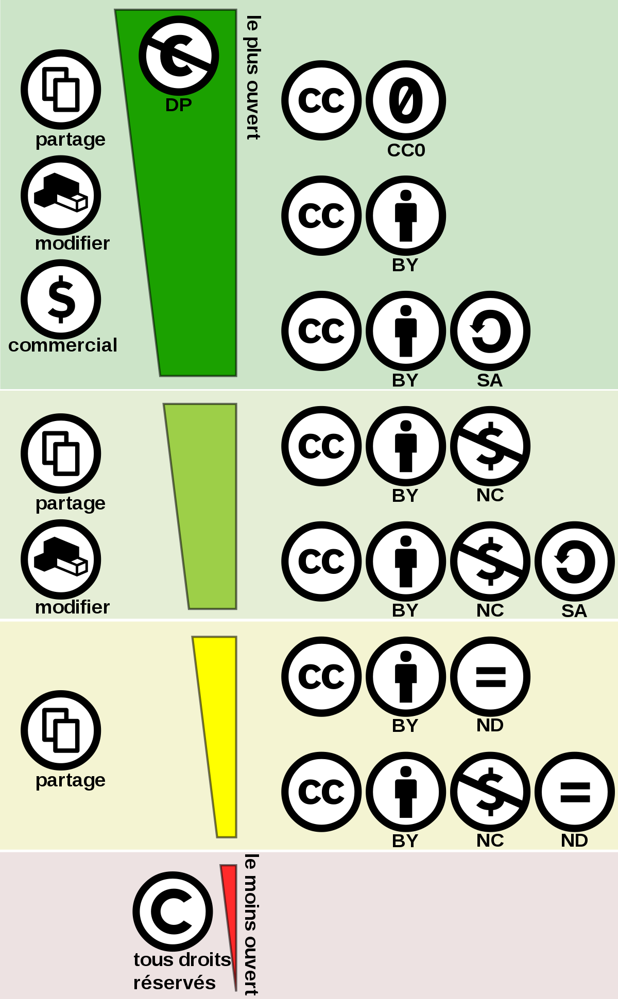

Numériser le patrimoine I: standards et bonnes pratiques

# Ouvrir la recherche: Quelques notions juridiques

Simon Gabay
Genève

---
# Droit de la propriété intellectuelle

---
## _Déclaration universelle des droits de l’homme_, art. 27

> Everyone has the right freely to participate in the cultural life of the community, to enjoy the arts and to share in scientific advancement and its benefits.

> Everyone has the right to the protection of the moral and material interests resulting from any scientific, literary or artistic production of which he is the author.

---
## Une contradiction dans ces principes ?

* Les chercheurs (ré-)utlisent le travail des autres (chercheurs)
* Les chercheurs sont donc aussi créateurs de ce qui est (ré-)utilisé

---
## Une contradiction dans ces principes ? (2)
* Il y a un fort soutien pour la diffusion non-commerciale de matériel pédagogique et de recherche
	* des institutions internationales (UNESCO OER)
	* des institutions européennes (_Digital agenda_ de l’UE)
	* des institutions nationales (FNS, ANR, DFG…)
* La législation ne reflète pas (forcément) ce souhait
	* pluralisme juridique (par ex., droit national vs droit supranational)
	* différences entre les systèmes juridiques
	* différentes définitions
* Le problème se complexifie avec l’exitence d’autres acteurs (notammen les éditeurs)

---
## Common law

* États-Unis, Angleterre, Canada (sauf le Québec), ancien
_Commonwealth_
* Primauté de la décision des juges (_Case law_)
* Notion de Copyright (mais aussi de _Copyleft_)

---
## La Common law en pratique

* Droit positif, contingent, et donc modifiable
* L’auteur peut abandonner ses droits
* Notion de _fair use_ (USA) ou _fair dealing_ ("utilisation équitable" au Canada, ailleurs "usage raisonnable" ou "acceptable") pour légitimer des usages illégaux dans l’intérêt de tous (éducation, citation)

---
## Le droit civil

* L'Europe continentale et, à différents degrés, nombre de ses anciennes colonies
* Primauté de la législation
* Notion de droit d’auteur (_Author’s right_, _Urheber-Recht_...)

---
## Droit civil en pratique
* Droit naturel, inhérent à la personne, et donc inaliénable
* L’auteur ne peut pas abandonner (tous) ses droits (par ex., les droits moraux)
* Existence de "droits voisins" (_related_ ou _neighbouring rights_) qui concerne les interprètes ou les concepteurs de base de données.

---
## Problèmes

* de formulation
	* _Universal **copyright** convention_
	* _Convention universelle sur le **droit d’auteur**_
	* Adoptée à Genève en 1952
* de territorialité
	* les lois nationales s’arrêtent aux frontières...
	* ... et s’appliquent sur le lieu de l’infraction
* de domaine d’application
	* le droit de la protection s’appiquent aux créations intellectuelles originales...
	* ... mais pas aux idées

---
# Ouvrir la recherche

---
## _Open_ ("ouvert" ou "libre")

* Différents types d’ouverture (définitions différentes, voire
concurentes)
* Différents degrés d’ouverture
* Deux principes de base
	* libre accès
	* libre redistribution

---
## _Open Access_ (ou "libre accès")

* Accès libre et public aux résultats de recherche
* _Gold open access_ ou "voie dorée": les éditeurs mettent
gratuitement les articles en ligne (principe de l’auteur-payeur)
* _Green open access_ ou "voie verte": les chercheurs mettent eux-même leurs recherches gratuitement en ligne (principe de l’auto-archivage, pre-print ou non)
* Voie intermédiaire: la barrière mobile (ou "embargo") qui restreint temporairement l’accès aux travaux

---
## _Open data_ (ou "données ouvertes")

* Accès libre et public aux données de recherche **sans restriction sur le droit d’accès et de réutilisation**
* Enjeu citoyen et démocratique fort, notamment concernant les données (d’utilité) publiques

---
## _Open source_

* Accès libre et public au code
* Différence entre le logiciel libre (_free software_, démarche politique de justice) et le logiciel _open source_ (démarche technique)
* l’_open source_ peut être une démarche commerciale

---
## _Open science_ (ou "science ouverte")

Démarche scientifique totalement ouverte
* _open data_
* _open source_
* _open methodology_ (la méthodologie est publique)
* _open peer review_ (les noms des relecteurs et leurs discussions sont publiques)
* _open access_

---
## FAIR data

* F (_findable_) car les données doivent être facilement trouvables, par un permalien par exemple et des métadonnées pour les moteurs de recherche
* A (_Accessible_) car les données doivent être récupérables par un protocole de communication (iiiF, OAI-PMH…), assorties d'une licence claire, et avec des données accessibles si les données sont sous embargo
* I (_Interoperable_) car les données doivent suivre des standards connus
* R (_Reusable_) car les données doivent autant que possible être réutilisable, notamment grâce à une documentation claire, en plus des points précédemment évoqués (standards, métadonnées…)

---
# Les licences
---

## Utiliser une licence

* pour les travaux dont on possède les droits
* en fonction de ces droits (co-auteurs, éditeurs, financeurs...)
* seulement pour la partie originale (pas de données brutes, comme les transcriptions)
* concernant quelques point clefs:
	* Attribution
	* Ré-utilisation
	* Vente
* Variante de "tous droits réservés" , plus précise

---
## Définition

> Une licence est une promesse formelle de ne pas porter plainte
> Pawel Kamocki 

---
## Creative commons

* Organisation à but non-lucratif
* fondée en 2001 par Lawrence Lessig
* qui propose des alternatives légales pour libérer des œuvres de la propriété intellectuelle
* mais qui ne s’intéresse uniquement qu’à quelques droits relatifs à l’œuvre

---
## Quatre pôles

1.  Attribution (BY): Signature de l’auteur initial
2.  Non commercial (NC): Interdiction de tirer un profit de l’œuvre sans autorisation de l’auteur
3.  No derivative (ND): Interdiction d’intégrer tout ou une partie dans une œuvre composite
4.  Share alike (SA): Partage de l’œuvre selon la même licence ou une licence similaire

---
## Six combinaisons possibles

---
## Dégradé de contrainte

---
## Exemple d'utilisation (wikipedia)

---
## Licence virale

Originellement utilisée pour la licence GNU GPL (_GNU General Public License_) avec l'idée que la réutilisation de code _open source_ rend le code _open source_.

Une définition plus l'ache serait qu'il faut le minimum de contraintes pour maximiser la réutilisation des données. Dans la pratique, on en resterait donc à _CC-BY_ sans autre restriction.

---
## _Copyleft_

La licence virale est un _copyleft_, mais il existe deux formes de ce dernier:

* _Copyleft fort_: redistributions du logiciel ou de l'œuvre en question, modifiés ou non, ainsi que de tous les composants ajoutés, ne peuvent se faire que sous la licence initiale.
* _Copyleft standard_: redistributions, modifiés ou non, se font sous la licence initiale mais que de nouveaux composants peuvent être ajoutés sous d'autres licences (propriétaires).

---
## CC Zero (_no rights attached_)

* S’approche au plus près du domaine public
* Aucune restriction de droit
* impossibilité juridique (droit d’auteur, droit moral. . . )
* sauf celles imposées par la loi? Alors revient à CC-BY

---
## _(Cultural) Heritage Data Reuse Charter_

Si principes fondateurs

* Ouverture (_Openness_): mise à disposition des données par les institutions patrimoniales
* Réciprocité (_Reciprocity_): intégration des résultats de recherche par les institutions patrimoniales
* Interopérabilité (_Interoperability_): utiliser les standards informatiques
* Citabilité (_Citability_): information nécessaire pour citer les différentes sources
* Intendance (_Stewardship_): héberger les données
* Fiabilité (_Trustworthiness_): documenter la provenance des données

---
## Alternatives

Des alternatives à creative commons existent
* _Open Data Commons_
* _Digital Peer Publishing Lizenzen_ (DPPL)
* _ETALAB_
* _GNU General Public License_
* _Berkeley Software Distribution_ (BSD)
* _MIT License_
* Chartes diverses…

---
## Outils en ligne

http://ufal.github.io/public-license-selector/

https://consent.dariah.eu/
