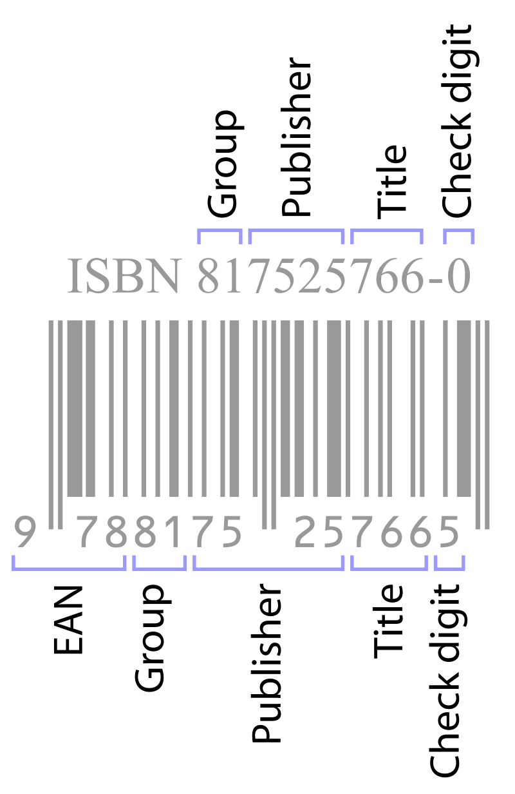
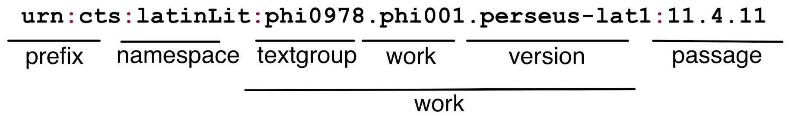
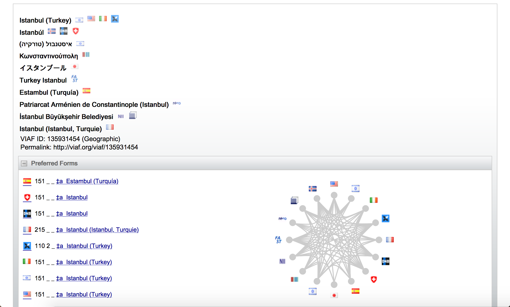
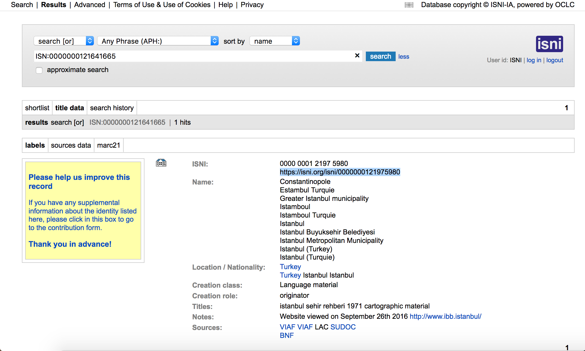
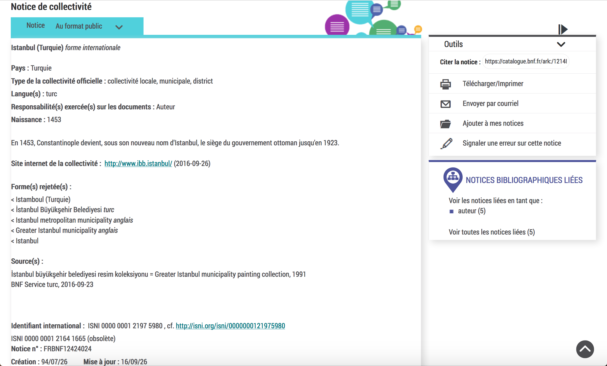
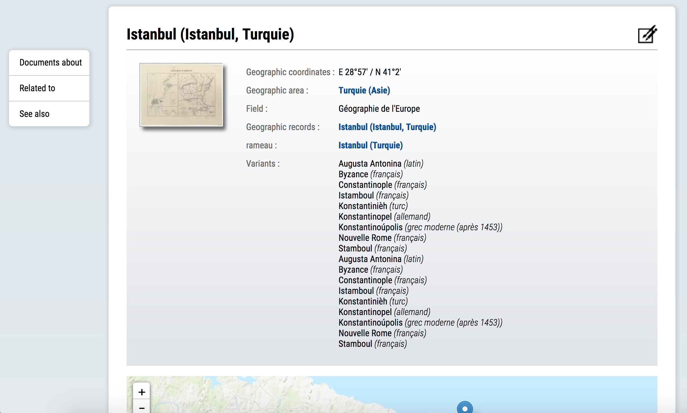
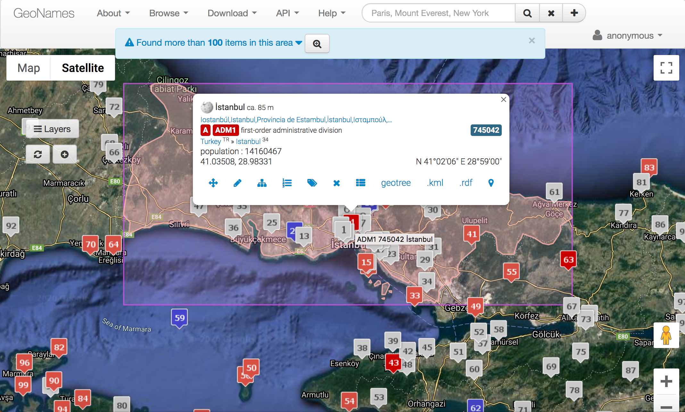
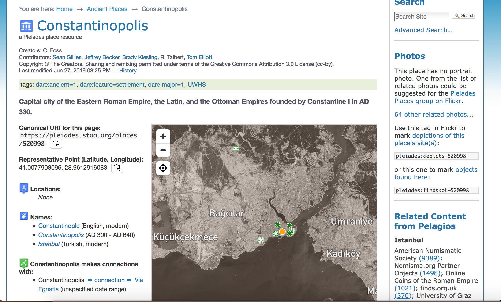
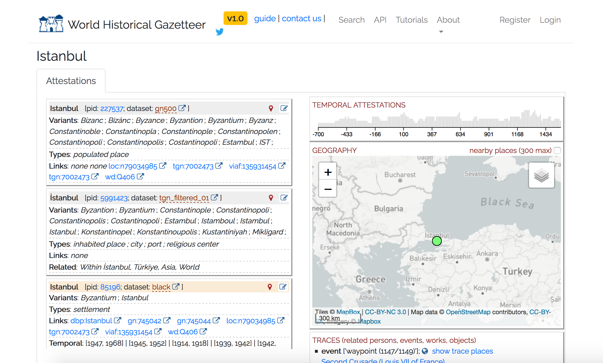

Numériser le patrimoine I: standards et bonnes pratiques

# Identifiants, entités et référentiels

Simon Gabay
Genève

<a rel="license" href="http://creativecommons.org/licenses/by/4.0/"></a>

---
# Entités nommées

---
## Entités nommées

Il s'agit d'une expression linguistique référentielle, notamment:
* Les noms propres, de personne ou de lieu: _Roger Federer_, _Genève_, _Berlin_, _Saint-Martin-d'Ablois_
* Les descriptions définies, soit un nom commun ou une locution nominale décrivant un individu ou un objet déterminé: la _ville lumière_, le _45ème président des États-Unis d'Amérique_, la _veuve de Henri IV_.

---
## Descriptions définies

En TEI `rs` (_reference string_)

Selon Russell ("On denoting", 1905), une description définie ne nomme pas un objet, mais affirme qu'il existe un et un seul objet qui satisfait cette description.

C'est un concept de philosophie analytique de forme _X_ ou _X_ est un nom commun ou une locution nominale qui décrit un individu ou un objet unique. Il existe des cas limites:
* Le _sénateur du Maine_
* Le _roi de France est chauve_
* Le _premier homme sur Mars_

---
## Reconnaissance d'entités nommées

C'est sous-tâche de l'activité d'extraction d'information dans des corpus documentaires.

Elle concerne les entitées nommées (noms propres et descriptions définies) mais aussi des objets textuels catégorisables dans des classes comme les quantités, les dates…

Il est possible de raffiner les catégories:
* Noms: personne, lieu, organisation…
* Quantités: distance, prix, poids…
* Date: absolue ou relative?

---
## Désambiguisation

Prenons un exemple: dans _Paris est en France_, _Paris_ fait-il référence à:
 Paris, Texas (la ville)
 _Paris, Texas_ (le film)
 Paris Hilton

Il convient de désambiguiser la référence à _Paris_ … Ce qui n'est pas une mince affaire (cf: <a href="https://fr.wikipedia.org/wiki/Liste_des_villes_s%27appelant_Paris" target="_blank">la liste des villes s'appelant Paris</a>).

---
## Annotation sémantique

L'annotation sémantique consiste à relier une expression de la source à l'entité d'une ontologie. Reprenons les exemple précédents:
* Paris, Texas (la ville) a pour ID dans Wikidata `Q830149`
* _Paris, Texas_ (le film) a pour ID dans Wikidata `Q160946`
* Paris Hilton a pour ID dans Wikidata `Q47899`

Il est possible de retrouver la page pour chaque entité en ajoutant l'url de wikidata:

* `https://www.wikidata.org/wiki/` + `ID`

* Ainsi: https://www.wikidata.org/wiki/Q160946

Depuis cette page, il est possible de retrouve la page de cet élément dans toutes les langues:
* Anglais: [https://en.wikipedia.org/wiki/Paris,\_Texas\_(film)](https://en.wikipedia.org/wiki/Paris,_Texas_(film))
* Français: [https://fr.wikipedia.org/wiki/Paris,\_Texas](https://fr.wikipedia.org/wiki/Paris,_Texas)

---
## Exemple

Exemple en ligne d'utilisation de Wikidata pour la désambiguisation: https://science-miner.com/entity-disambiguation/


---
# Les liens

---
## Adresse

Il existe une multitude de manières de nous joindre:
* Un numéro de téléphone
	* `022 379 03 50`
	* `+41 22 379 03 50` (comparez avec le précédent)
* Une adresse physique:
	* `24 rue du Général-Dufour, CH - 1211 Genève 4`
* Une adresse web: https://www.unige.ch

Être joignable ne suffit cependant pas: il faut être joignable de manière stable, définir à partir d'où et comment

---
## URI

URI= _Uniform Resource Identifier_ pour "identifiant uniforme de ressource". C'est une courte chaîne de caractères identifiant une ressource sur un réseau. Sa définition technique est la suivante:

`URI = scheme:[//authority]path[?query][#fragment]`

où authority est défini de la manière suivante:
`authority = [userinfo@]host[:port]`

Une URI peut être de type _name_ (URN) ou _locator_ (URL). Nous allons revenir sur ce point.

---
## Exercice

Identifiez le _scheme_, le _path_…:

* `Tel:+41 22 379 03 50`
* `Fax:+41 22 379 11 34`
* `urn:ISSN:0167-6423`
* `mailto:simo.gaba@unige.ch`
* `https://fr.wikipedia.org/wiki/Victor_Hugo#Jersey`
* `https://www.swissbib.ch/Search/Results?lookfor=victor+hugo`
* `http://localhost:8888/tree`
* `gabays@193.12.45.63:/home`


---
## URN

l'URN (_Uniform Resource Name_) est une syntaxe de chaîne de caractères utilisable pour identifier une ressource globalement, durant toute son existence, indépendamment de sa localisation ou de son accessibilité par Internet.

Sa syntaxe est la suivante:

`urn:NID:NSS`

où
* NID (_Namespace Identifier_) identifie l'espace de nom
* NSS (_Namespace specific String_) est l'ID dans l'espace de nom

---
## ISBN

Ce système est utilisé pour les livres par exemple, avec l'ISBN (_International Standard Book Identifier_)



Il faut différencier l'ISBN-10 (au dessus) de l'ISBN-13 ou EAN-13 (en dessous, pour le code-barre)

L'URN de ce livre est donc: `urn:isbn:817525766-0`

---
## CTS

En philologie, un nouveau format de distribution de texte (DTS, _Distributed Text Services_) s'appuie sur des URN utilisant CTS (_Canonical Text Services_)



* À côté de `latinLit` il existe `greekLit`
* `phi0978` renvoit à Pline l'ancien (Cf. https://catalog.perseus.org/catalog/urn:cts:latinLit:phi0978)
* `phi001` renvoit à l'_Histoire naturelle_
* _etc._

---
## URL

Une URL (_Uniform Resource Locator_), couramment appelée adresse web, est une chaîne de caractères uniforme qui permet d'identifier une ressource du World Wide Web par son emplacement et de préciser le protocole internet pour la récupérer.

On les reconnait au fait qu'elles commencent souvent par `http://` et (désormais) `https://`, qui est le protocole de transfert de texte (_Hypertext Transfer Protocol (Secured)_). Par exemple:

`https://fr.wikipedia.org`

Il en existe néanmoins d'autres comme `ftp://` pour _File Transfer Protocol_ (copier un fichier, l'effacer, etc.).

---
## URN vs URL

* Un URN (_Uniform Resource Name_) est un URI qui identifie une ressource par son nom dans un espace de noms. Un URN peut être employé pour parler d'une ressource sans que cela préjuge de son emplacement ou de la manière de la référencer.
* Un URL (_Uniform Resource Locator_) est un URI qui, outre le fait qu'il identifie une ressource sur un réseau, fournit les moyens d'agir sur une ressource ou d'obtenir une représentation de la ressource en décrivant son mode d'accès primaire ou « emplacement » réseau.

---
## Identifiant pérenne

C'est une chaîne de caractères alphanumériques qui désigne une ressource indépendamment de son emplacement.

Il faut distinguer:
* L'identifiant pérenne
* L'URL, qui peut changer

On a donc besoin
* d'un registre d’association entre identifiant et URL d’accès
* d’un résolveur redirigeant l’utilisateur

Il s'agit notamment des services de type DOI

---
## DOI

Un DOI (_Digital object identifier_)

* URN: `doi:10.1145/3371140.3371146`
* URL: `https://dl.acm.org/doi/10.1145/3371140.3371146`

Une requête renvoie ce type de (méta)données

```console
⇒ GET /id/doi:10.5072/test9999 HTTP/1.1
⇒ Host: ez.datacite.org

⇐ HTTP/1.1 200 OK
⇐ Content-Type: text/plain; charset=UTF-8
⇐ Content-Length: 208
⇐
⇐ success: doi:10.5072/test9999
⇐ _created: 1300812337
⇐ _updated: 1300913550
⇐ _target: http://www.gutenberg.org/ebooks/7178
⇐ _profile: datacite
```

---
## ARK

Un ARK (_Archival Resource Key_) suit la syntaxe suivante: `[http://NMA/]ark:/NAAN/Name[Qualifier]`
* NMA pour _Name Mapping Authority_
* NAAN pour _Name Assigning Authority Number_
	* `12148`: Bibliothèque nationale de France
	* `81055`: British Library
	* `72163`: DasCH (pour la Suisse)


La dualité autorité d'adressage / identifiant permet de présenter un même document dans plusieurs contextes de diffusion

---

On note l'ajout de données supplémantaires, qui sont des médatonnées (cf. _erc…_)

```console
⇒ GET /id/ark:/99999/fk4cz3dh0 HTTP/1.1
⇒ Host: ezid.cdlib.org

⇐ HTTP/1.1 200 OK
⇐ Content-Type: text/plain; charset=UTF-8
⇐ Content-Length: 208
⇐
⇐ success: ark:/99999/fk4cz3dh0
⇐ _created: 1300812337
⇐ _updated: 1300913550
⇐ _target: http://www.gutenberg.org/ebooks/7178
⇐ _profile: erc
⇐ erc.who: Proust, Marcel
⇐ erc.what: Remembrance of Things Past
⇐ erc.when: 1922
```
métadonnées ERC (_Electronic Resource Citation_) pour lesquelles il existe un _<a href="https://www.dublincore.org/specifications/dublin-core/dc-kernel" target="_blank">maping</a>_ avec les _Dublin Core Kernel Metadata_ (_kernel_ signifie "noyau")

---
## Suffixes ARK

Des qualificatifs - ou suffixes - ark permettent de déterminer:
* la page: `https://gallica.bnf.fr/ark:/12148/bpt6k53011/f420`
* l'image: `https://gallica.bnf.fr/ark:/12148/bpt6k53011/f420.texteBrut`
* le zoom: `https://gallica.bnf.fr/ark:/12148/bpt6k53011/f420.zoom`
* télécharger: `https://gallica.bnf.fr/ark:/12148/bpt6k53011/f420.jpeg`
* Cf. <a href="https://gallica.bnf.fr/blog/24032016/apprenez-lire-les-url-de-gallica" target="_blank">le site de Gallica</a> pour plus d'informations.
---
## Suffixes iiiF
* Le manifeste: `https://gallica.bnf.fr/iiif/ark:/12148/bpt6k53011/manifest.json`
* Informations sur une page: `https://gallica.bnf.fr/iiif/ark:/12148/bpt6k53011/f420/info.json`
* Complexités: `https://gallica.bnf.fr/iiif/ark:/12148/bpt6k53011/f420/0,1900,2400,1200/full/45/native.jpg`

---
## Schéma iiiF

Le schéma est le suivant: `{scheme}://{server}{/prefix}/{identifier}/{region}/{size}/{rotation}/{quality}.{format}`
	* `region`: zone sélectionnée dans l'image source (par exemple `0,1900,2400,1200` ou `full` pour toute l'image
	* `size`: taille de l'image cible générée en pixels (ou `full`)
	* `rotation`: correspond à un angle de rotation
	* `quality` correspond à une transformation (`native`, `bitonal`)
	* `format`: `.png`, `.jpeg`…

---
# Référentiels

---
## Référentiels
Existe-t-il un ISBN pour les personnes? Les lieux? les lieux du passés disparus? Oui!

En français on parle de référentiel, mais en anglais on parle d'_authority file_.

En science de l'information, une _autorité_ (ou notice d'autorité ou forme d'autorité) sert à identifier sans ambiguïté des personnes ou d'autres concepts, et à faciliter la recherche.

* Il peut y avoir des problèmes de nom:

```console
Aquin, Thomas von (Theologist, Philosopher)
תומס די אקוינו
Аквинский, Фома
Von Aquin, Thomas (Heiliger)
```

* Ou des homonymes: Louis II de France vs Louis II de Bavière

---
## Des Référentiels

Quelques exemples:
* VIAF (_Virtual International Authority File_) : https://viaf.org
* BNF : http://data.bnf.fr
* ISNI (_International Standard Name Identifier_) : http://www.isni.org
* PLEIADES : https://pleiades.stoa.org
* GeoNames : http://www.geonames.org
* …

Il existe aussi des solutions locales, comme <a href="https://search.ortsnamen.ch" target="_blank">Ortsnamen.ch</a>.

L'idée n'est pas d'en avoir un seul, mais de tous les lier et de faire en sorte qu'ils communiquent.

---
## VIAF
<a href="https://viaf.org/viaf/135931454" target="_blank">https://viaf.org/viaf/135931454</a>



---
## ISNI
<a href="https://isni.org/isni/0000000121975980" target="_blank">https://isni.org/isni/0000000121975980</a>



---
## Catalogue BNF
<a href="https://catalogue.bnf.fr/ark:/12148/cb11864652s" target="_blank">https://catalogue.bnf.fr/ark:/12148/cb11864652s</a>



---
## Data BNF
<a href="https://data.bnf.fr/en/11961919/15312191" target="_blank">https://data.bnf.fr/en/11961919/15312191</a>



---
## GeoNames
<a href="http://www.geonames.org/745044" target="_blank">http://www.geonames.org/745044</a>



---
## Pleiades
<a href="https://pleiades.stoa.org/places/520998" target="_blank">https://pleiades.stoa.org/places/520998</a>



---
## WHG
<a href="http://dev.whgazetteer.org/places/12345979/portal" target="_blank">http://dev.whgazetteer.org/places/12345979/portal</a>


---
